# CertReady

Plataforma para **prepararte para certificaciones técnicas** (AWS, Azure, GCP, CompTIA, Cisco, Kubernetes, …) y **entrevistas de programación**, con una capa analítica que mide tu desempeño y un motor de decisiones que estima qué tan listo estás y te dice qué estudiar a continuación.

No es una maqueta: es un sistema **políglota, por microservicios, desplegado en AWS**, construido con la disciplina de algo que tiene que vivir en producción. Está en línea ahora mismo:

> **Demo en vivo:** https://certready.duckdns.org  ·  Web (Next.js) + móvil (Flutter) consumiendo las mismas APIs.

Este documento explica **el sistema completo, detalle a detalle**: las metodologías, las arquitecturas, qué hace cada pieza del código y los diagramas (flujo, secuencia, clases, ER y dimensional) para que puedas entenderlo sin abrir 40 archivos primero. La fuente canónica del diseño y las decisiones (ADRs) sigue siendo [`docs/arquitectura-y-fases-certready.md`](docs/arquitectura-y-fases-certready.md); aquí está el panorama real, lo que de verdad corre.

---

## Índice

1. [Qué resuelve y para quién](#1-qué-resuelve-y-para-quién)
2. [Metodologías (cómo se construyó y por qué)](#2-metodologías-cómo-se-construyó-y-por-qué)
3. [Arquitectura de alto nivel](#3-arquitectura-de-alto-nivel)
4. [Mapa de componentes y puertos](#4-mapa-de-componentes-y-puertos)
5. [Backend en Go (los servicios)](#5-backend-en-go-los-servicios)
6. [El juez de código (subsistema crítico)](#6-el-juez-de-código-subsistema-crítico)
7. [Capa de datos en Python (ETL · OLAP · DSS)](#7-capa-de-datos-en-python-etl--olap--dss)
8. [La web (Next.js, patrón BFF)](#8-la-web-nextjs-patrón-bff)
9. [La app móvil (Flutter)](#9-la-app-móvil-flutter)
10. [Modelos de datos (ER transaccional, documental, dimensional)](#10-modelos-de-datos)
11. [Diagramas de secuencia (los flujos importantes)](#11-diagramas-de-secuencia)
12. [Seguridad](#12-seguridad)
13. [Despliegue](#13-despliegue)
14. [CI/CD](#14-cicd)
15. [Puesta en marcha local](#15-puesta-en-marcha-local)
16. [Pruebas](#16-pruebas)
17. [Estructura del repositorio](#17-estructura-del-repositorio)
18. [Convenciones y cómo contribuir](#18-convenciones-y-cómo-contribuir)
19. [Estado del proyecto](#19-estado-del-proyecto)
20. [Documentación](#20-documentación)
21. [Licencia](#21-licencia)

---

## 1. Qué resuelve y para quién

CertReady tiene **dos superficies de producto** sobre una misma base:

1. **Preparación de certificaciones.** El estudiante elige una o varias certificaciones, recibe **material de estudio** organizado como ruta de aprendizaje (estilo Duolingo) y presenta **simulacros cronometrados** con formato real (muestreo ponderado por dominio, corte de aprobación, repaso con explicaciones).
2. **Preparación de entrevistas técnicas.** Ejercicios tipo **LeetCode** evaluados automáticamente por un **juez de código en sandbox**, más un banco de **preguntas (Q&A) por puesto y área**.

Encima de todo eso corre **analítica dimensional (OLAP)** que mide el desempeño y un **DSS** (sistema de apoyo a decisiones) que estima la *readiness* —probabilidad de aprobar— con un modelo psicométrico (IRT), recomienda la siguiente mejor acción y, a partir de tu CV, propone qué certificaciones te convienen.

El contenido es **original** (sin copiar guías oficiales ni "brain dumps") y la identidad es **propia** (sin logos de terceros). El detalle de la política de marcas está en [`docs/contenido-y-marcas.md`](docs/contenido-y-marcas.md) (y en las reglas locales `.claude/rules/marcas-certificaciones.md`).

---

## 2. Metodologías (cómo se construyó y por qué)

Esta es la parte que separa un proyecto serio de un demo. Cada decisión está registrada como ADR en el documento de arquitectura; aquí va el resumen de **qué metodología se usó y en qué consiste**.

### 2.1 Construcción por fases con criterio de salida (DoD)
El alcance del MVP **es** el sistema completo (no una versión recortada). Lo que se recorta es el **orden**: ocho fases (0 a 7), cada una con objetivo, entregables y un *Definition of Done* verificable. No se avanza de fase sin cumplir su DoD. Esto evita el clásico "todo a medias" y garantiza que cada fase entrega algo usable de punta a punta. El plan vive en el doc de arquitectura; el estado real en [`docs/estado-roadmap.md`](docs/estado-roadmap.md).

### 2.2 Políglota con disciplina
Cuatro lenguajes en producción, cada uno **solo donde aporta**:

- **Go** — único lenguaje de **servicios**. Binarios estáticos, contenedores diminutos, arranque en milisegundos, concurrencia barata. Un solo lenguaje de servicios = menos runtimes, pipelines y superficie que parchear.
- **Python** — **solo en la capa de datos** (`data/`): ETL, OLAP y DSS. Nunca en el path del cliente ni en servicios de app. Es el único lugar donde el ecosistema científico (embeddings, numérico) justifica su peso.
- **TypeScript / Next.js** — la web, con patrón BFF.
- **Dart / Flutter** — un solo código para Android e iOS.

La regla "Python solo en datos" no es estética: mantiene el path del cliente predecible y barato de operar.

### 2.3 Local-first y costo cero (ADR-07 a ADR-14)
El proyecto se desarrolla y verifica **entero en local, a $0**, y se despliega en AWS dentro de lo que cabe en el presupuesto. Cada base gestionada de pago tiene su equivalente local: PostgreSQL local/Neon, MongoDB local/Atlas M0, ClickHouse+Cube en Docker. El aislamiento entre "local" y "nube" vive en el **código 12-factor**: todo entra por variables de entorno (`DATABASE_URL`, `MONGO_URI`, `CLICKHOUSE_*`), de modo que un servicio **no sabe** contra qué infraestructura corre. Migrar de entorno es cambiar una URL, no el dominio.

### 2.4 Microservicios dueños de sus datos, sin FK cruzadas (ADR-09)
Cada servicio es **dueño de su esquema** y nadie más lo toca. Las referencias entre dominios (p. ej. una inscripción que apunta a una certificación) son **lógicas**: se guarda el id y se valida vía HTTP contra el servicio dueño, nunca con una *foreign key* entre esquemas. Esto mantiene las fronteras limpias y permite desplegar/escalar servicios por separado.

### 2.5 Patrón BFF (Backend for Frontend)
El navegador **solo** habla con la web (Next.js). La web es un *Backend for Frontend*: guarda la sesión en una **cookie cifrada** (iron-session), valida y proxea a los servicios Go inyectando el `Bearer` token del lado del servidor. El cliente nunca ve un token de servicio ni una URL interna. El móvil, en cambio, llama directo a las APIs Go `/v1` (no necesita BFF porque no expone secretos en un navegador).

### 2.6 Modelo dimensional + OLAP sin MDX (ADR-12)
La analítica usa un **esquema estrella plano** en **ClickHouse** (el hecho denormaliza sus dimensiones como columnas, idiomático de ClickHouse) y **Cube** como capa semántica que expone medidas y dimensiones como **API SQL/REST**. Se descartó MDX a propósito: las pre-agregaciones de Cube cumplen el rol del cubo pre-computado, pero todo se consulta con SQL.

### 2.7 DSS con psicometría real (ADR-13)
La *readiness* no es un porcentaje inventado: se calcula con **IRT Rasch (1PL)** calibrado por población (numpy puro, sin scipy). Es un modelo de teoría de respuesta al ítem que separa **dificultad** del ítem y **habilidad** del estudiante, lo que da una estimación defendible de "probabilidad de aprobar". El recomendador de CV usa **embeddings locales (ONNX)** —sin enviar datos personales a un tercero—, lo que respeta la privacidad y el $0.

### 2.8 Seguridad por diseño (Fase 7)
OIDC/JWT desde el día uno, RBAC, autorización a nivel de objeto (anti-IDOR/BOLA), validación de entrada, secretos fuera del código, *security headers*, *rate limiting*, RLS en PostgreSQL como defensa en profundidad, sanitización de archivos y un **sandbox endurecido** para el código del usuario. Ver §12.

### 2.9 Verificación por fase y convenciones estrictas
Cada fase se cierra con pruebas reales (unitarias + integración contra Postgres/Mongo/ClickHouse de verdad, y la suite de escape del sandbox con Docker). Convenciones por lenguaje (`gofmt`/`golangci-lint`, `ruff`/`black`, `eslint`/`prettier`, `dart format`), **commits convencionales**, y reglas scopeadas por carpeta en [`.claude/rules/`](.claude/rules/). Detalle en [`CONTRIBUTING.md`](CONTRIBUTING.md).

---

## 3. Arquitectura de alto nivel

Conviven **dos topologías** a propósito: la **real desplegada hoy** (una sola caja EC2, para la demo a bajo costo) y la **objetivo de producción** (AWS gestionado, escrita en Terraform y validada, parqueada hasta tener presupuesto). El **mismo código** sirve a ambas: cada servicio Go expone un único `http.Handler` con dos *entrypoints* (`cmd/server` para HTTP/contenedor y `cmd/lambda` para Lambda).

### Topología real (demo en producción)

Una sola instancia **EC2 Ubuntu** corre todo el stack; **Caddy** termina TLS y proxea al `next start`. Solo se exponen 443 (Caddy) y 22 (SSH).

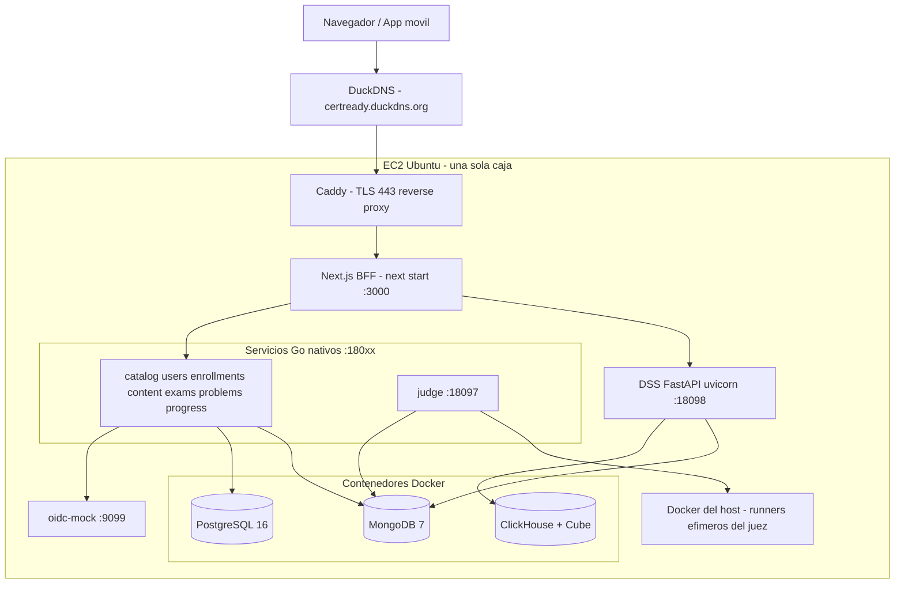

### Topología objetivo (AWS gestionado, parqueada)

Solo el *edge* queda expuesto; servicios y datos viven en subredes privadas. Está escrita en Terraform (`infra/`), validada con `terraform validate`, pero **no aplicada** (operar a costo cero hasta tener presupuesto).

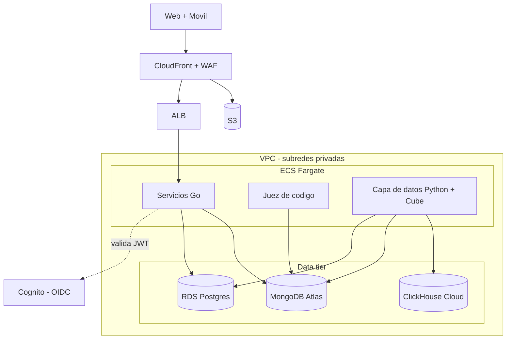

> En producción, `oidc-mock` se reemplaza por **Cognito** (mismo contrato OIDC) y las bases Docker por servicios gestionados. Nada del dominio cambia.

---

## 4. Mapa de componentes y puertos

| Componente | Lenguaje | Puerto local | Datos | Rol |
|---|---|---|---|---|
| `oidc-mock` | Go | 9099 | Postgres (`idp_users`) | Emisor OIDC de dev (sustituye Cognito) |
| `catalog` | Go | 18090 | Postgres (`catalog`) | Certificaciones, temas, pistas de entrevista |
| `users` | Go | 18091 | Postgres (`users`) | Identidad de app, perfiles, RBAC |
| `enrollments` | Go | 18092 | Postgres (`enrollments`) | Inscripciones estudiante↔objetivo |
| `progress` | Go | 18093 | Postgres (`progress`) | Avance: lecciones, quizzes, Q&A |
| `content` | Go | 18094 | MongoDB | Material de estudio |
| `exams` | Go | 18095 | Mongo + Postgres (`exams`) | Banco de preguntas, simulacros, intentos |
| `problems` | Go | 18096 | MongoDB | Problemas tipo LeetCode + Q&A |
| `judge` | Go + Docker | 18097 | Mongo + Postgres (`judge`) | Ejecuta código en sandbox y califica |
| `DSS` | Python (FastAPI) | 18098 | ClickHouse + Mongo | Readiness (IRT), analítica, recomendador |
| `web` | Next.js | 3000 | — (BFF) | App web; única superficie que ve el navegador |
| `health` | Go | 8080 | — | Servicio de referencia (plantilla mínima) |
| PostgreSQL | — | 5432 | — | Transaccional |
| MongoDB | — | 27017 | — | Contenido/preguntas |
| ClickHouse | — | 8123 | — | OLAP |

Los servicios internos (`9099`, `180xx`, `5432`, `27017`, `8123`) **no se exponen**: en local quedan en `localhost`, en la EC2 detrás del *security group*. Solo la web sale a internet.

---

## 5. Backend en Go (los servicios)

Todos los servicios comparten el mismo esqueleto: **configuración 12-factor**, **logging estructurado** (`slog` JSON), **apagado ordenado** (SIGINT/SIGTERM), API **REST/JSON versionada bajo `/v1`**, y sondas `GET /v1/health` (liveness) y `GET /v1/ready` (readiness, que pinga sus dependencias). La cadena de middleware HTTP, el pool de Postgres, la validación OIDC y el runner de migraciones viven en la librería compartida `libs/platform`.

### 5.1 La librería compartida — `libs/platform`

| Paquete | Qué provee |
|---|---|
| `config` | Lectura de entorno con *fallback* (`getenv(key, default)`). |
| `logging` | Logger `slog` JSON con nombre de servicio y entorno. |
| `httpx` | El **kit HTTP**: middleware, sondas de salud, helpers JSON. |
| `postgres` | Pool `pgxpool`, abstracción `Querier`, helpers de **RLS** (`Q`, `RLSTx`, `TxFromContext`), runner de migraciones. |
| `auth` | Validación de **JWT/OIDC** (descubre el issuer y el JWKS, verifica firma RS256, issuer, audiencia, expiración; extrae `sub`, `email`, `name`, roles de `cognito:groups`+`role`), `Middleware` y `RequireRole`. |
| `mongo` | Conexión al cliente de MongoDB. |

**La cadena de middleware** (`httpx.Chain`), de fuera hacia dentro:

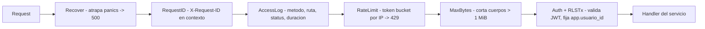

- **`RateLimit`** — *token bucket* por IP en memoria (200 rps, ráfaga 400 por defecto); responde **429** con `Retry-After`; exime `/v1/health` y `/v1/ready`. Es defensa base por instancia; el límite robusto y distribuido lo da el WAF en producción.
- **`MaxBytes`** — corta cuerpos mayores a **1 MiB** (`http.MaxBytesReader`) para frenar DoS por payload.
- **`RLSTx`** — abre una transacción y ejecuta `SET LOCAL app.usuario_id = <sub>` por petición, de modo que las *policies* de PostgreSQL filtren por dueño aunque el código fallara (ver §12). Se compone **dentro** de Auth (necesita el `sub` del token). Es un *kill-switch* por servicio (`*_RLS_ENABLED`).

### 5.2 Servicios, uno por uno

#### `catalog` — Postgres (`catalog`)
Catálogo de certificaciones, temas y pistas de entrevista. Lectura **pública**, escritura **admin**.
- `GET /v1/certifications` · `GET /v1/certifications/{idOrSlug}` · `GET /v1/certifications/{id}/topics`
- `GET /v1/topics/{id}` · `GET /v1/tracks` · `GET /v1/tracks/{idOrSlug}`
- `POST /v1/certifications` *(admin)*

#### `users` — Postgres (`users`)
Identidad de aplicación y perfiles. **Aprovisiona el usuario en el primer acceso** (JIT) a partir de los claims del token (el `id` ES el `sub` del JWT).
- `GET /v1/me` *(auth; crea la fila si es el primer login)* · `PATCH /v1/me` *(auth)* · `GET /v1/users` *(admin)*

#### `enrollments` — Postgres (`enrollments`, con **RLS**)
Inscripciones del estudiante a objetivos del catálogo. Valida que el objetivo exista llamando a `catalog` (referencia lógica, sin FK cruzada). Autorización por pertenencia.
- `POST /v1/enrollments` · `GET /v1/me/enrollments` · `PATCH /v1/enrollments/{id}` · `DELETE /v1/enrollments/{id}` *(todos auth, solo lo propio)*

#### `progress` — Postgres (`progress`, con **RLS**)
Avance real del estudiante: lecciones leídas, resultado de quizzes por tema y autoevaluaciones de Q&A (nivel 1–3, *append-only* para analítica).
- `POST /v1/progress/lessons` · `POST /v1/progress/quizzes` · `POST /v1/progress/qa` · `GET /v1/me/progress`

#### `content` — MongoDB
Sirve material de estudio. Lectura pública, creación admin.
- `GET /v1/content` · `GET /v1/content/{id}` · `POST /v1/content` *(admin)*

#### `exams` — Mongo (preguntas) + Postgres (`exams`, con **RLS**)
Banco de preguntas en Mongo; sesiones, intentos y calificación en Postgres. Genera simulacros, califica del lado del servidor (**nunca** filtra la respuesta correcta al cliente) y registra el intento (que luego alimenta la analítica).
- `POST /v1/exams/sessions` · `POST /v1/exams/sessions/{id}/submit` · `GET /v1/exams/sessions/{id}` · `GET /v1/me/exams` · `POST /v1/questions` *(admin)*

#### `problems` — MongoDB
Banco de problemas tipo LeetCode (con casos de prueba **ocultos** y límites) y banco de **Q&A** por puesto/área. La lectura pública **nunca** expone los casos ocultos ni las salidas esperadas.
- `GET /v1/problems` · `GET /v1/problems/{id}` *(solo casos visibles)* · `POST /v1/problems` *(admin)*
- `GET /v1/qa` · `GET /v1/qa/{id}` · `POST /v1/qa` *(admin)*

#### `judge` — Mongo (problemas) + Postgres (`judge`) + Docker
El subsistema crítico. Ver §6.
- `POST /v1/judge/runs` · `GET /v1/judge/runs/{id}` · `GET /v1/me/judge/runs`

#### `health` — sin estado
Plantilla mínima desplegable: `GET /v1/health`, `GET /v1/ready`. Sirvió para validar el pipeline end-to-end en Fase 0.

### 5.3 El emisor OIDC de desarrollo — `tools/oidc-mock`
Sustituye a Cognito en local **con el mismo contrato OIDC**, así el código de validación de JWT es idéntico en dev y en prod. Guarda usuarios en Postgres (`idp_users`, contraseña con **bcrypt**); el `sub` se deriva determinísticamente del email (mismo email → mismo `sub`, lo que hace seguro el aprovisionamiento JIT). Expone descubrimiento, JWKS, `/authorize`, `/token`, `/userinfo` (flujo OIDC + PKCE) y además `/register` y `/login` de primera parte (para los formularios nativos de la web y el móvil). El admin se asigna por lista de emails (`OIDC_MOCK_ADMIN_EMAILS` → claim `cognito:groups=["admin"]`).

---

## 6. El juez de código (subsistema crítico)

Ejecutar código de terceros es el componente de **mayor riesgo** del sistema. La regla (ADR-11) es: **cada ejecución corre en un contenedor Docker efímero y endurecido**, uno por caso de prueba.

### Diseño de clases (el contrato extensible)

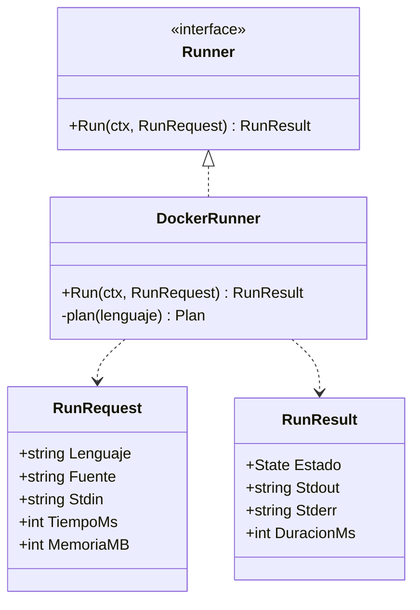

La interfaz `Runner` permite añadir lenguajes (hoy **Python**; luego Go, JS) **sin tocar la calificación**. `Calificar(...)` recorre los casos visibles + ocultos, normaliza la salida (CRLF→LF, *trim*), y emite un veredicto global (Accepted / WrongAnswer / TimeLimit / MemoryLimit / RuntimeError).

### Endurecimiento del sandbox (flags por ejecución)

| Flag | Valor | Para qué |
|---|---|---|
| `--network` | `none` | Sin red |
| `--read-only` | — | Raíz inmutable |
| `--tmpfs /tmp` | `rw,noexec,nosuid,size=64m` | Único escribible; sin ejecutar/setuid |
| volumen `/sandbox` | solo lectura | El código del usuario se monta `:ro` |
| `--memory` = `--memory-swap` | límite del problema | Memoria acotada, **sin swap** |
| `--cpus` | `1.0` | CPU acotada |
| `--pids-limit` | `64` | Anti *fork-bomb* |
| `--user` | `65534:65534` (nobody) | Sin privilegios |
| `--cap-drop` | `ALL` | Cero capabilities |
| `--security-opt` | `no-new-privileges` | Sin escalada |
| `timeout -k 3 <s>` + *backstop* por contexto | +8 s de holgura | Corte de tiempo robusto |

**Anti-fuga:** los casos ocultos y sus salidas esperadas viven en Mongo; el juez los lee del lado del servidor para calificar y **jamás** los devuelve al cliente. La ejecucion se registra en Postgres (`judge.ejecuciones`) para historial y analítica. La Fase 3 incluyó una **suite de escape** (red, FS, fork-bomb, memoria, tiempo) que corre en CI con Docker.

### Cómo corre una entrega

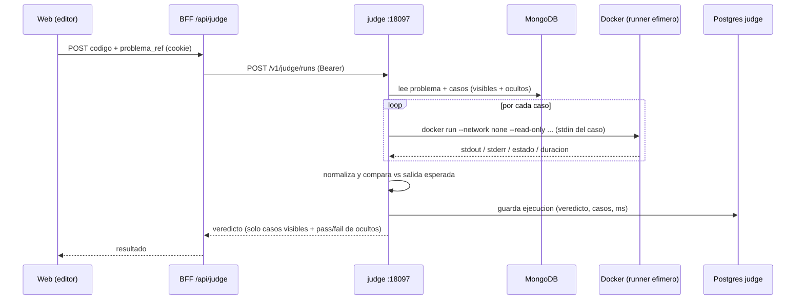

---

## 7. Capa de datos en Python (ETL · OLAP · DSS)

Todo Python vive aquí (`data/`). Tres piezas: el **ETL** que arma el modelo dimensional, **Cube** como capa semántica, y el **DSS** (FastAPI) que convierte los hechos en decisiones.

### 7.1 ETL — operacional → dimensional (`data/etl`)

Lleva los **hechos operativos** (intentos de examen, ejecuciones del juez, autoevaluaciones de Q&A) desde Postgres a un **esquema estrella plano en ClickHouse**, enriqueciendo cada hecho con metadatos de MongoDB (tema, dificultad, área, …). Es **incremental por *watermark*** e **idempotente**.

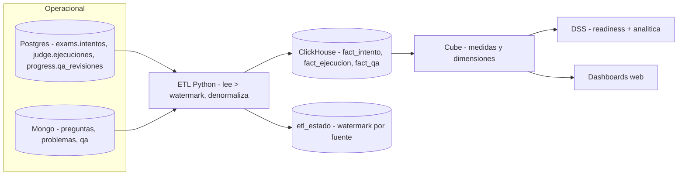

- **Hechos:** `fact_intento`, `fact_ejecucion`, `fact_qa` (motor `ReplacingMergeTree` → re-ejecutar deduplica por id = idempotencia). Un cuarto registro, `etl_estado`, guarda el *watermark* (`ultimo_ts`) por fuente.
- **Watermark:** filtra `where creado_en > ultimo_ts`; las marcas de tiempo usan `DateTime64(6)` (microsegundos) para no reprocesar filas del mismo segundo.
- **Dependencias mínimas:** solo *drivers* (`clickhouse-connect`, `psycopg`, `pymongo`); sin pandas/numpy en el ETL. Las transformaciones son **funciones puras** testeables.

### 7.2 OLAP — Cube sobre ClickHouse (`data/cube`)
Cube define los cubos como capa semántica y los expone como API:
- **`intentos`** (sobre `fact_intento`): medidas `count`, `correctos`, **`accuracy`**; dimensiones certificación, tema, dificultad, tipo de pregunta, modo, tiempo.
- **`ejecuciones`** (sobre `fact_ejecucion`): `count`, `aceptadas`, **`tasa_aceptacion`**, `duracion_media`; dimensiones área, dificultad, lenguaje, veredicto, tiempo.

Las pre-agregaciones materializadas quedan diferidas (requieren Cube Store en el despliegue gestionado); el modelo semántico ya es funcional sin ellas.

### 7.3 DSS — readiness, analítica y recomendador (`data/dss`)

FastAPI que lee ClickHouse (con degradación elegante: si ClickHouse no está, devuelve 200 "sin datos" en vez de 5xx). La conexión es **perezosa** (no conecta al importar), y la lógica numérica es **pura** (testeable sin DB).

| Método | Endpoint | Qué devuelve |
|---|---|---|
| GET | `/v1/health` | Liveness |
| GET | `/v1/readiness/{usuario_id}?certificacion=` | readiness %, probabilidad de aprobar, habilidad θ, dominio por celda, siguiente acción |
| POST | `/v1/recommendations` | Sube CV (multipart) → perfil + caminos + certificaciones recomendadas |
| GET | `/v1/analytics/{usuario_id}?certificacion=` | total/aciertos/%, acierto por tema, tendencia por fecha |
| GET | `/v1/puestos` | Catálogo de puestos (con sus áreas de Q&A y de código) |
| GET | `/v1/job-readiness/{usuario_id}?puesto=` | Readiness combinada por puesto (exámenes + código + Q&A) |

**El modelo IRT Rasch (1PL)**, tal como está codificado:

- **Dificultad de la celda** `(tema, dificultad)`: `b = -logit(p_global)` donde `p_global` es el acierto de la población. Menos acierto poblacional → `b` más alto (más difícil).
- **Habilidad del estudiante** `θ`: estimación **MAP** con prior `N(0, σ²=4)` por **Newton-Raphson 1D** (estabiliza el arranque en frío).
- **Readiness:** media ponderada de `sigmoid(θ − b)` sobre las celdas que el usuario ha tocado.
- **Probabilidad de aprobar:** aproximación normal del puntaje de un examen de `n=20` ítems contra un umbral (0.7).
- **Siguiente mejor acción:** la celda con menor `sigmoid(θ − b)` (donde más conviene estudiar).

**El recomendador de CV** (`recomendador.py`): extrae texto del PDF/DOCX/plano (con límite de páginas, anti *zip-bomb* y `422` ante archivos corruptos), calcula **embeddings locales** con `fastembed` (modelo ONNX multilingüe `paraphrase-multilingual-MiniLM-L12-v2`, ~120 MB, se cachea), y rankea las ~50 certificaciones del dataset curado combinando **similitud semántica + solape de habilidades + bonus por área**. El CV se procesa **en memoria y no se persiste** (ADR-14).

**Job-readiness** combina tres señales con pesos por puesto (renormaliza si falta alguna): exámenes (IRT), código (mejor `aceptado` por problema) y Q&A (mejor `nivel` por pregunta).

### 7.4 Los *seeders* (de dónde sale el contenido)
- `scripts/seed-temas.sql` — los 12 temas del temario AWS SAA-C03 (idempotente).
- `scripts/seed-mongo.py` — contenido profundo de `aws-saa` (material + ~50 preguntas originales por los 4 dominios) + problemas de código + Q&A.
- `scripts/catalog/*.json` + `scripts/seed-catalog.py` — el catálogo de **~50 certificaciones** (AWS/Azure/GCP/CompTIA/Cisco/CNCF/HashiCorp/…), con temas, material y quizzes ligeros.
- `scripts/build-reco-dataset.py` — compila `data/dss/certificaciones.json` (el dataset del recomendador) a partir de los manifiestos.
- `scripts/seed-demo-user.py` — siembra actividad realista de un usuario demo (exámenes, ejecuciones, Q&A, inscripciones y avance) para que la analítica y la readiness muestren números.

---

## 8. La web (Next.js, patrón BFF)

Next.js 15 (App Router, *server components* por defecto). El navegador solo habla con la web; esta valida la sesión y proxea a los servicios Go/DSS inyectando el token del lado del servidor.

### 8.1 Sesión y guardas
- **`lib/env.ts`** — valida **toda** la configuración con `zod` al arrancar (falla rápido si falta una URL o el `SESSION_PASSWORD` < 32 chars). No se importa nunca en el cliente (contiene secretos).
- **`lib/auth/session.ts`** — sesión con **iron-session** (cookie cifrada AES-GCM, `httpOnly`, `sameSite=lax`, `secure` solo en producción). Guarda `subject`, `email`, `nombre`, `roles`, `accessToken`, `refreshToken`, `expiresAt` y el estado PKCE durante el login.
- **`lib/auth/guard.ts`** — `requireSession()` para *server components* protegidos: redirige a `/login` si no hay sesión.
- **`lib/api/client.ts` + `services.ts`** — cliente HTTP tipado de los servicios (añade `Bearer`, `cache: 'no-store'`, *timeout*, maneja 204/404, lanza `ApiError`). ~65 funciones tipadas agrupadas por servicio.
- **`lib/rate-limit.ts`** — *token bucket* en memoria aplicado a los endpoints de auth (anti fuerza bruta por IP).

### 8.2 Rutas

**Públicas:** `/` (landing), `/login`, `/registro`, `/auth/error`.

**Protegidas** (`app/(protected)`, exigen sesión):

| Ruta | Qué hace |
|---|---|
| `/panel` | Inicio tipo app: inscripciones con avance, racha y meta semanal (derivadas de lecciones reales), último simulacro |
| `/estudiar` · `/estudiar/[cert]` · `/estudiar/[cert]/[tema]` | Ruta de aprendizaje (estilo Duolingo): temas con estado bloqueado/disponible/completado, lector de hojas + mini-quiz que desbloquea el siguiente |
| `/examenes` · `/examenes/[id]` | Lista/historial de simulacros; *runner* cronometrado con envío y repaso |
| `/entrevistas` · `/problemas/[id]` · `/preguntas/[id]` | Hub de entrevistas: problemas con **editor de código** evaluado por el juez, y banco de **Q&A** por puesto |
| `/progreso` | Avance real + dashboards de analítica (acierto por dominio vía DSS) |
| `/preparacion` | Readiness por **puesto** (exámenes + código + Q&A combinados) |
| `/recomendaciones` | "Mi camino": sube tu CV → recomendaciones del DSS |
| `/certifications` | Catálogo con inscripción |
| `/perfil` · `/admin` | Perfil propio; panel de admin (gated por rol) |

### 8.3 Rutas BFF (`app/api`)
`auth/login` (POST nativo · GET inicia OIDC), `auth/register`, `auth/callback` (intercambia el código y sella la sesión), `auth/logout`, `me` (GET/PATCH), `enrollments` (+`[id]`), `examenes` (+`[id]/submit`), `judge`, `progress/{lessons,quizzes,qa}`, `recommendations`. Cada una proxea al servicio correspondiente con el token de la sesión.

### 8.4 Sistema de diseño y animaciones
Identidad propia azul→morado, fuentes Fredoka/Nunito/IBM Plex Mono. Componentes: `sidebar` (menú con íconos **Lottie**), `landing` (hero con shaders WebGL + título "gooey" + secciones con *scroll reveal*), `quiz-runner`, `code-editor`, `gauge`, `cv-recommender`, sistema de tarjetas con borde *beam* y CTA arcoíris.

**Optimización móvil:** la landing detecta móvil/táctil (server-side por *user-agent* y client-side por `matchMedia`) y degrada lo caro: usa fondo de degradado CSS en vez de WebGL, reemplaza el ensamblado de letras por *fade*, mueve los *reveals* a IntersectionObserver y desactiva filtros costosos — para que el scroll vaya plano en celular. **Endurecimiento:** *security headers* en `next.config.mjs` (HSTS, `X-Frame-Options: DENY`, `nosniff`, `Referrer-Policy`, `Permissions-Policy`, CSP en *report-only*), `output: 'standalone'`, `poweredByHeader: false`.

---

## 9. La app móvil (Flutter)

Cliente Android/iOS que consume **directamente** las APIs Go `/v1` (sin BFF: no hay navegador donde esconder secretos). Arquitectura en tres capas: `core` (config, api, auth, router, theme), `features` (una carpeta por pantalla) y los modelos que **espejan** los tipos de la web.

- **Estado:** Riverpod (sin code-gen). **Routing:** go_router con guarda de auth. **HTTP:** Dio con interceptores (inyecta `Bearer`, reintenta una vez ante 401 con *refresh*).
- **Auth:** OIDC + PKCE por HTTP contra `oidc-mock`/Go (login y registro nativos); el `sub` se extrae del JWT para las llamadas al DSS. En el emulador Android, `tool/adb-reverse.ps1` mapea los puertos locales.
- **Pantallas (paridad con la web):** Panel, Catálogo+inscripción, Estudiar (ruta+lector+quiz), Exámenes (simulacro+historial+repaso), Entrevistas (banco de Q&A — los problemas de código se quitaron del móvil por practicidad), Progreso (readiness+acierto por tema), Mi camino (recomendador por CV con `file_picker` o pegar texto), Perfil.
- **Marca:** mismas fuentes (Fredoka/Nunito), Material 3 sembrado de la paleta, animaciones con `flutter_animate` (entradas escalonadas, *gauges* y barras animadas, *reveal* de resultados).
- **Plataformas cableadas:** Android, iOS, Web y Windows (este último requiere Modo Desarrollador por `file_picker`).

> **Importante:** cuando cambie un contrato de la API Go, hay que actualizar **ambos** lados: `web/lib/api/types.ts` y `mobile/lib/core/api/models.dart`.

---

## 10. Modelos de datos

Tres modelos, cada uno donde encaja: **relacional** para lo transaccional (PostgreSQL), **documental** para contenido heterogéneo (MongoDB) y **dimensional** para analítica (ClickHouse).

### 10.1 Transaccional — PostgreSQL (un esquema por servicio)

Cada servicio es dueño de su esquema; **no hay FK entre esquemas** (las referencias cruzadas son lógicas, por id, validadas vía HTTP).

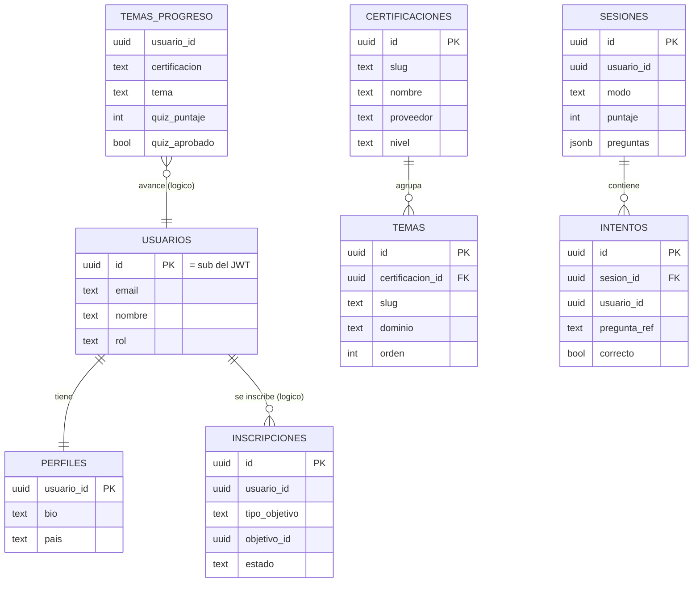

Esquemas reales: `catalog` (certificaciones, temas, pistas_entrevista), `users` (usuarios, perfiles), `enrollments` (inscripciones), `exams` (sesiones, intentos), `progress` (lecciones, temas, qa_revisiones), `judge` (ejecuciones). Los que llevan `usuario_id` tienen **RLS** activable.

### 10.2 Documental — MongoDB
Contenido heterogéneo donde el esquema cambia de forma: **preguntas** (opción/respuesta múltiple, con su explicación), **problemas** de código (enunciado, `starter_code` por lenguaje, `test_cases` con casos **ocultos** y límites), **material** de estudio (markdown), y **Q&A** por puesto/área. La **definición** vive en Mongo; el **hecho** del intento se va a la capa analítica.

### 10.3 Dimensional — ClickHouse (esquema estrella plano)

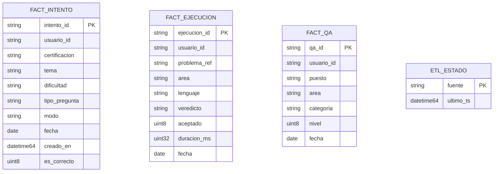

Las dimensiones (usuario/cohorte, certificación/proveedor, tema/dominio, dificultad, tiempo, modo, área, lenguaje) son **lógicas**: están denormalizadas como columnas del hecho y las define **Cube**, no tablas separadas. Esto evita claves subrogadas y *joins* en el ETL — idiomático de ClickHouse.

---

## 11. Diagramas de secuencia

### 11.1 Login (patrón BFF + OIDC nativo)

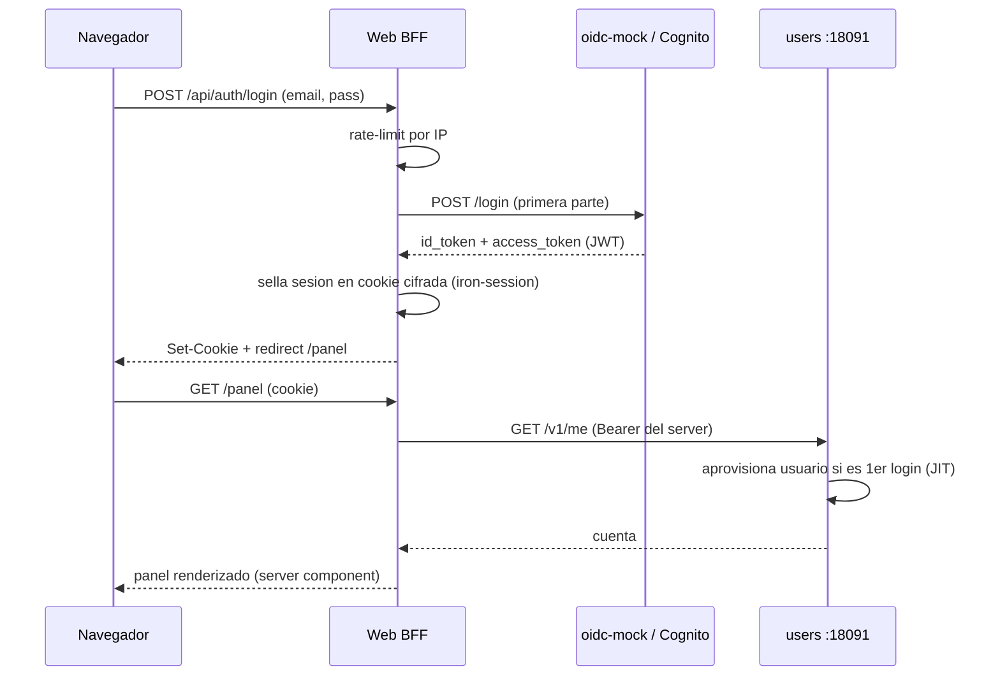

### 11.2 Simulacro de examen

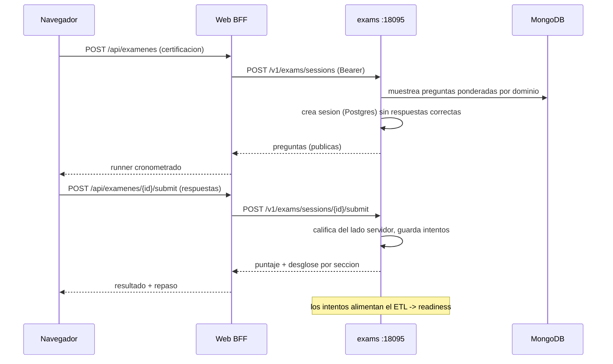

### 11.3 De la actividad a la readiness (analítica)

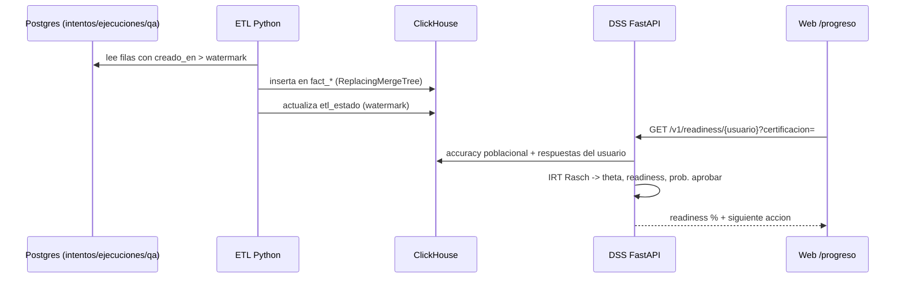

---

## 12. Seguridad

El modelo de amenaza asume que el código del usuario es hostil y que un estudiante intentará ver datos de otro. Las defensas (la mayoría de la **Fase 7**):

- **AuthN:** OAuth2/OIDC (Cognito en prod, `oidc-mock` en dev), **JWT corto + refresh**. Validación de firma RS256, issuer, audiencia y expiración en `libs/platform/auth`.
- **AuthZ:** RBAC (rol `admin` para administración) + **autorización a nivel de objeto** en cada endpoint (un estudiante solo toca lo suyo). Probado anti **IDOR/BOLA**.
- **RLS (defensa en profundidad):** *policies* en PostgreSQL (`enrollments`, `progress`, `exams`) que filtran por `app.usuario_id`, fijado por transacción vía el middleware `RLSTx`. Aunque el código fallara, la BD solo devuelve las filas del dueño. *Kill-switch* por servicio.
- **Sandbox del juez:** contenedores efímeros sin red, FS de solo lectura, límites de CPU/memoria/PIDs/tiempo, sin privilegios; casos ocultos nunca expuestos. Suite de escape en CI.
- **Rate limiting:** *token bucket* por IP en los servicios Go y en los endpoints de auth de la web; el DSS limita la subida de CV.
- **Tamaño de cuerpo:** `MaxBytes` (1 MiB) en los servicios; el CV se lee acotado (5 MiB) con anti *zip-bomb* y límite de páginas.
- **Headers + transporte:** HSTS, `X-Frame-Options: DENY`, `nosniff`, `Referrer-Policy`, `Permissions-Policy`, CSP (report-only); TLS de extremo a extremo (Caddy); nada sensible en *query strings*.
- **Secretos:** fuera del código (env/Secrets Manager); `SESSION_PASSWORD` generado por despliegue.
- **Privacidad:** el CV se procesa en memoria y **no se persiste**.

La superficie pensada para *pentesting* (OWASP Top 10: NoSQLi, SQLi, IDOR/BOLA, manipulación de JWT, fuga del sandbox, *broken access control*) está documentada en [`docs/seguridad-y-produccion.md`](docs/seguridad-y-produccion.md).

---

## 13. Despliegue

### 13.1 Lo que corre hoy — una sola EC2
Para la demo a bajo costo, **todo el stack corre en una instancia EC2 Ubuntu** (clase `t3.medium`/`m7i-flex`): las bases en contenedores Docker, los binarios Go nativos, el DSS con uvicorn, y la web en **build de producción** (`next start`). Delante, **Caddy** termina TLS y proxea; el dominio es **DuckDNS** (`certready.duckdns.org`). El *security group* solo abre 443 y 22. El paso a paso para reproducirlo está en [`docs/demo-aws-ec2.md`](docs/demo-aws-ec2.md).

`scripts/ec2-up.sh` levanta el stack completo en la VM (Docker para Postgres/Mongo/ClickHouse, imagen del juez, venv de datos, compila Go, migra, siembra, corre el ETL, escribe `web/.env.local` con el host público vía **IMDSv2** y arranca la web). `scripts/ec2-down.sh` lo detiene.

> Aprendizaje operativo: al redeployar hay que **reiniciar de verdad** el proceso de Next (`pkill -f "next"` + `rm -rf .next` + `next build` + `next start`); reconstruir sin reiniciar deja sirviendo la versión vieja.

### 13.2 La ruta objetivo (AWS gestionado, en Terraform)
`infra/` tiene los módulos de las **dos rutas**: la de **costo cero** activa (Lambda + Function URL, sin VPC/NAT, CI/CD por OIDC) y la de **producción** parqueada (`network`, `ecr`, `ecs`, `iam`, `secrets`, `cognito`) para ECS Fargate + ALB + RDS + CloudFront/WAF. Está validada con `terraform validate` pero **no aplicada** (decisión de costo). El procedimiento para activarla está en [`infra/README.md`](infra/README.md) y [`docs/despliegue-aws.md`](docs/despliegue-aws.md).

---

## 14. CI/CD

GitHub Actions (`.github/workflows/ci.yml`), por push/PR a `main`. Cuatro *jobs*:

- **`go`** — `gofmt` (falla si hay sin formatear), `go vet` + `go test` por módulo, contra **Postgres 17 + MongoDB 7** reales (servicios del runner).
- **`sandbox`** — construye la imagen del juez y corre la **suite de escape** del sandbox con Docker.
- **`data`** — `ruff` + `black --check` + `pytest` en `data/`.
- **`web`** — `npm run check` (typecheck + lint + formato + tests) + `npm run build`.

El despliegue automático está escrito pero pospuesto hasta tener la cuenta AWS conectada.

---

## 15. Puesta en marcha local

**Requisitos:** Go 1.25+, Node 20+, Python 3.12+, Docker (para bases, juez y ClickHouse). En Windows, `scripts/dev-up.ps1` orquesta **todo**:

```powershell
# Levanta bases (Docker), compila Go, migra, siembra, corre ETL,
# arranca oidc-mock + 7 servicios + judge + DSS + web. Imprime http://localhost:3000
./scripts/dev-up.ps1

# Detener todo
./scripts/dev-down.ps1
```

Arranque manual de un servicio (ejemplo `catalog`):

```bash
go run ./tools/oidc-mock           # emisor OIDC en :9099 (en otra terminal)
cd services/catalog
export CATALOG_DATABASE_URL='postgres://postgres@localhost:5432/certready_dev?sslmode=disable'
go run ./cmd/migrate
go run ./cmd/server                 # :8080

cd ../../web
cp .env.example .env.local          # ajusta URLs y SESSION_PASSWORD
npm install && npm run dev          # http://localhost:3000
```

La guía detallada está en [`docs/desarrollo-local.md`](docs/desarrollo-local.md).

---

## 16. Pruebas

```bash
go test ./...                       # servicios + librería (dobles en memoria)
# Integración (Postgres/Mongo reales; se omite si no defines las URLs de test):
export CATALOG_TEST_DATABASE_URL='postgres://postgres@localhost:5432/certready_test?sslmode=disable'
go test ./services/catalog/...

cd data && pip install -e ".[dev]" && ruff check . && black --check . && pytest
cd web  && npm run check            # typecheck + lint + formato + tests
cd mobile && flutter analyze && flutter test
```

La suite de escape del sandbox (juez) corre con Docker y `JUDGE_DOCKER_TESTS=1`.

---

## 17. Estructura del repositorio

```
certready/
├── services/        Servicios Go (uno por carpeta, módulo propio)
│   ├── health/        Plantilla mínima desplegable
│   ├── catalog/       Certificaciones, temas, pistas de entrevista (Postgres)
│   ├── users/         Identidad, perfiles, RBAC (Postgres)
│   ├── enrollments/   Inscripciones (Postgres + RLS)
│   ├── progress/      Avance: lecciones, quizzes, Q&A (Postgres + RLS)
│   ├── content/       Material de estudio (MongoDB)
│   ├── exams/         Simulacros e intentos (Mongo + Postgres + RLS)
│   └── problems/      Problemas de código + Q&A (MongoDB)
├── judge/           Juez de código en sandbox (Go + Docker)
├── libs/platform/   Librería Go compartida (httpx, postgres/RLS, auth, …)
├── tools/oidc-mock/ Emisor OIDC de desarrollo (sustituye Cognito)
├── data/            Capa de datos en Python (etl, cube, dss)
├── web/             App web (Next.js, patrón BFF)
├── mobile/          App Flutter (Android/iOS/Web/Windows)
├── infra/           Terraform (ruta costo-cero activa + producción parqueada)
├── scripts/         dev-up / ec2-up, seeders, datasets
├── docs/            Arquitectura, fases, bitácora, despliegue, seguridad
└── .claude/rules/   Convenciones scopeadas por carpeta
```

Es un **monorepo multi-módulo de Go** coordinado por `go.work`; cada servicio y la librería son módulos independientes con su propio `go.mod`.

---

## 18. Convenciones y cómo contribuir

- **Go:** `gofmt` + `golangci-lint`/`go vet`; errores envueltos con `%w`; `slog` (nunca `fmt.Println`); config 12-factor; tests con `go test ./...`.
- **Python:** `ruff` + `black`, *type hints*; **solo en `data/`**; tests con `pytest`.
- **TypeScript:** `eslint` + `prettier`; `npm run check` antes de commitear.
- **Dart:** `dart format` + `flutter analyze`.
- **Commits convencionales** (`feat:`, `fix:`, `chore:`, `docs:`, …); lint y tests en verde antes de cada commit; rama desde `main`, PR con CI verde (sin push directo a `main`).
- Reglas específicas por carpeta en `.claude/rules/` (locales) y el detalle en [`CONTRIBUTING.md`](CONTRIBUTING.md).

---

## 19. Estado del proyecto

| Fase | Foco | Estado |
|---|---|---|
| 0 | Fundaciones (infra + CI/CD) | ✅ Completa |
| 1 | Identidad y catálogo | ✅ Completa (backend + web) |
| 2 | Contenido y exámenes | ✅ Completa |
| 3 | Entrevistas + juez de código | ✅ Completa (sandbox endurecido) |
| 4 | Capa analítica (OLAP) | ✅ Backend completo (ETL + Cube) |
| 5 | DSS (readiness) | ✅ Backend completo (IRT + recomendador) |
| 6 | Móvil (Flutter) | 🚧 En curso (paridad de módulos; falta login Cognito nativo, push, iOS, tiendas) |
| 7 | Endurecimiento + producción | ✅ Hardening hecho · 🟢 desplegado en AWS EC2 (demo); ruta Fargate parqueada |

El **MVP web** está completo y optimizado (incluido móvil), el backend de las Fases 1–5 verificado contra bases reales, el hardening de Fase 7 aplicado, y el sistema **desplegado y en línea** en AWS. El detalle vivo está en [`docs/estado-roadmap.md`](docs/estado-roadmap.md) y la cronología en [`docs/BITACORA.md`](docs/BITACORA.md).

---

## 20. Documentación

| Documento | Contenido |
|---|---|
| [`docs/arquitectura-y-fases-certready.md`](docs/arquitectura-y-fases-certready.md) | Arquitectura, ADRs y plan de fases (fuente canónica) |
| [`docs/estado-roadmap.md`](docs/estado-roadmap.md) | Qué está hecho y qué falta |
| [`docs/desarrollo-local.md`](docs/desarrollo-local.md) | Levantar el entorno completo en local |
| [`docs/seguridad-y-produccion.md`](docs/seguridad-y-produccion.md) | Endurecimiento y superficie de pentesting |
| [`docs/demo-aws-ec2.md`](docs/demo-aws-ec2.md) | Desplegar la demo en una EC2 paso a paso |
| [`docs/despliegue-aws.md`](docs/despliegue-aws.md) | Ruta de producción (Fargate) y costos |
| [`docs/contenido-y-marcas.md`](docs/contenido-y-marcas.md) | Política de contenido original y marcas |
| [`docs/BITACORA.md`](docs/BITACORA.md) | Registro cronológico de decisiones |
| [`CONTRIBUTING.md`](CONTRIBUTING.md) | Convenciones, flujo y cómo añadir un servicio |

---

## 21. Licencia

Todos los derechos reservados. Este repositorio no incluye una licencia de uso; el código es propietario salvo acuerdo explícito por escrito. CertReady no está afiliada, avalada ni patrocinada por AWS, Microsoft, Google ni otros proveedores; las marcas pertenecen a sus respectivos dueños.
