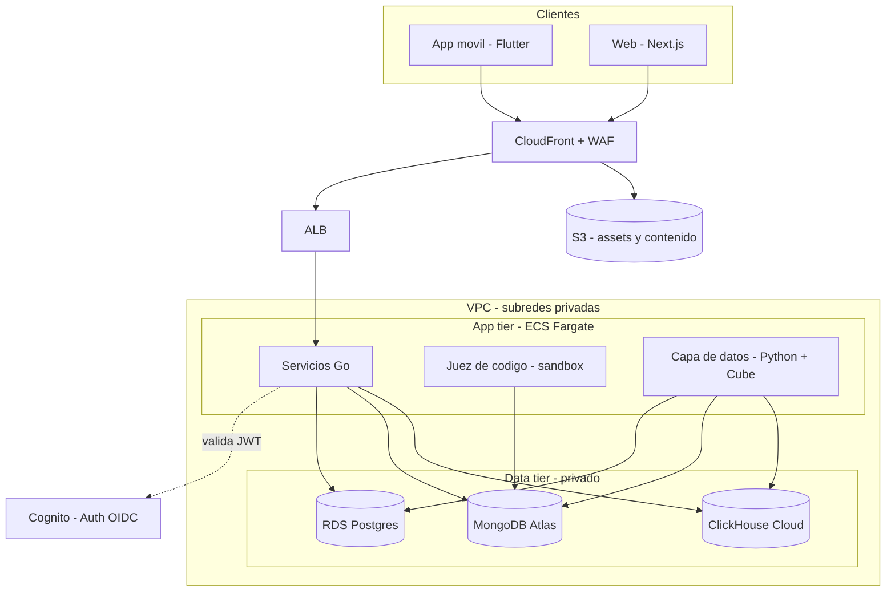
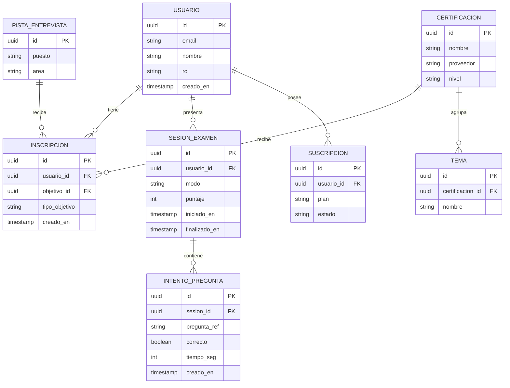
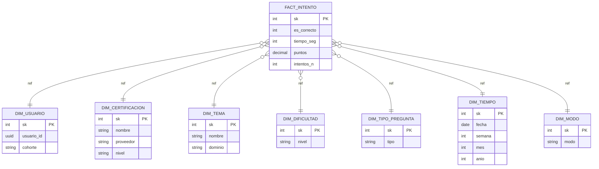
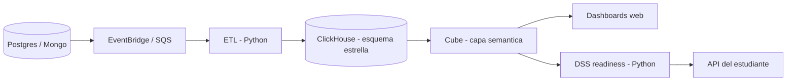

# CertReady — Documento de Arquitectura y Plan de Fases

> **Nombre de trabajo:** *CertReady* (cámbialo cuando quieras).
> **Tipo:** Plataforma web + móvil (iOS/Android) para preparación de certificaciones y entrevistas técnicas.
> **Objetivo no negociable:** que sea **realista y desplegable en el mundo real** sobre AWS, con arquitectura políglota y cada tecnología usada solo donde aporta.

---

## 0. Estado del documento

Cuatro decisiones de stack quedaron fijadas con mis valores recomendados. Las alternativas están registradas en la sección [Decisiones de arquitectura (ADRs)](#6-decisiones-de-arquitectura-adrs) y se pueden cambiar **sin alterar el plan de fases**.

| Decisión | Elegido (default) | Alternativa registrada |
|---|---|---|
| Cómputo de contenedores | ECS Fargate | EKS (si quieres experiencia Kubernetes) |
| Autenticación | Amazon Cognito | Keycloak self-hosted (más control / más superficie de pentesting) |
| Motor OLAP | ClickHouse Cloud + Cube | Redshift Serverless (todo AWS-native) |
| Cliente móvil | Flutter (Dart) | React Native (TS) |
| Lenguaje de consulta analítica | **SQL (vía Cube)** — **sin MDX** | — (decisión cerrada) |

---

## 1. Visión y producto

CertReady ayuda a un estudiante a **certificarse** y a **prepararse para entrevistas técnicas**. Son dos superficies de producto dentro de una sola plataforma:

1. **Preparación de certificaciones.** El estudiante elige una o varias certificaciones (p. ej. AWS, Azure, GCP, CompTIA, Cisco, Kubernetes). La app le entrega **contenido de estudio** y **exámenes de práctica** (simulacros cronometrados con scoring y repaso).
2. **Preparación de entrevistas técnicas.** Ejercicios tipo **LeetCode** evaluados automáticamente, más **preguntas y ejercicios por puesto/área** que el estudiante busca.

Sobre todo eso corre una **capa analítica (OLAP/dimensional)** que mide el desempeño y alimenta un **DSS** que predice qué tan listo está el estudiante y le recomienda qué estudiar.

**Plataformas:** Web (Next.js) + móvil nativo iOS/Android (Flutter), consumiendo las mismas APIs.

---

## 2. Alcance del MVP

El MVP **es el alcance completo** descrito arriba (no una versión recortada):

- Selección de **varias certificaciones** por estudiante.
- **Contenido de estudio** + **exámenes de práctica** por certificación.
- **Entrevistas técnicas:** ejercicios tipo LeetCode + Q&A por puesto/área.
- **Web + iOS + Android.**
- **Capa analítica OLAP** + **DSS de readiness**.
- **Despliegue en AWS** con prácticas de producción y **seguridad auditeable** (para pentesting propio).

Las [fases](#14-fases-de-implementación-roadmap) son el **orden de construcción** de ese alcance completo, no un recorte de features.

---

## 3. Principios de arquitectura

1. **Herramienta correcta para cada trabajo.** Ninguna tecnología entra por inercia ni por especialización personal.
2. **Políglota con disciplina.** Un solo lenguaje principal de backend; se ramifica solo donde hay una razón técnica real. Menos lenguajes = menos pipelines, runtimes y superficie que mantener y parchear.
3. **Python solo en la capa de datos.** Nunca en el desarrollo de la app ni en el path del cliente.
4. **Seguridad por diseño.** Auth/OIDC, JWT, RBAC, aislamiento de red, gestión de secretos y un sandbox estricto para código de usuario, desde el día uno.
5. **Cloud-native / realista.** Todo en contenedores, IaC, CI/CD, observabilidad. Servicios gestionados donde reducen riesgo operativo.
6. **Separación de responsabilidades.** Datos operativos (transaccional) separados de datos analíticos (OLAP); el cliente nunca habla directo con la base.

---

## 4. Stack tecnológico

| Capa | Tecnología | Por qué (encaje real) |
|---|---|---|
| Móvil | **Flutter (Dart)** | Un solo código para iOS + Android, resultado near-native, buen DX para equipo chico. |
| Web | **Next.js / React (TypeScript)** | SSR/SEO, ecosistema maduro, tipado compartible. |
| Servicios backend | **Go** | Binarios estáticos, contenedores diminutos, arranque rápido, alta concurrencia → despliegue barato y simple en AWS. Un único lenguaje de servicios. |
| Juez de código | **Multi-lenguaje (por naturaleza)** + orquestación en Go | El usuario elige su lenguaje; corre aislado en sandbox y no contamina el resto. |
| Capa de datos | **Python (FastAPI + jobs)** | ETL, capa analítica y DSS. Único lugar donde Python aporta de verdad. |
| Datos transaccionales | **PostgreSQL (RDS)** | Integridad relacional, ACID, transacciones. |
| Contenido / preguntas | **MongoDB (Atlas)** | Esquemas heterogéneos (tipos de pregunta variados, problemas de código con test cases). |
| OLAP / analítico | **ClickHouse Cloud + Cube** | Columnar, agregaciones rápidas, modelo dimensional expuesto como API. Sin MDX. |

> **Nota sobre el políglota:** el conteo de lenguajes en producción es Go + Python + Dart + TypeScript. La capa de datos (Python) se expone como servicio interno; **el cliente nunca toca Python**.

---

## 5. Arquitectura de alto nivel

Solo el *edge* queda expuesto a internet. Servicios y datos viven en subredes privadas dentro de la VPC. El tráfico entra por CloudFront/WAF → ALB → capa de aplicación (Fargate) → capa de datos.



**Comunicación entre servicios:** REST/JSON síncrono a través del ALB con descubrimiento por ECS Service Connect (Cloud Map). Eventos asíncronos (p. ej. "intento registrado") se publican a **EventBridge/SQS** y los consume el pipeline de datos. APIs versionadas (`/v1/...`).

---

## 6. Decisiones de arquitectura (ADRs)

Formato corto por decisión: **contexto → opciones → decisión → justificación**.

### ADR-01 — Lenguaje de backend: Go
- **Opciones:** Go, TypeScript (NestJS), Kotlin (JVM), Python.
- **Decisión:** Go como único lenguaje de servicios.
- **Justificación:** despliegue simple en AWS (imágenes diminutas, arranque rápido en Fargate/Lambda), concurrencia, y se descarta Python para la app por preferencia explícita de despliegue. Si el equipo va más fuerte en TS/Kotlin, cualquiera es válido; lo importante es **elegir uno y ser consistente**.

### ADR-02 — Móvil: Flutter
- **Opciones:** Flutter, React Native, nativo (Swift + Kotlin).
- **Decisión:** Flutter.
- **Justificación:** un solo código iOS+Android con resultado near-native; nativo doble duplica esfuerzo y suma dos lenguajes. Alternativa: React Native si se quiere compartir lenguaje (TS) con la web.

### ADR-03 — MongoDB gestionado: Atlas, no DocumentDB
- **Opciones:** Amazon DocumentDB, MongoDB Atlas (sobre AWS).
- **Decisión:** MongoDB Atlas, conectado por PrivateLink a la VPC.
- **Justificación:** DocumentDB va atrás en features y compatibilidad frente a MongoDB real; para evitar sorpresas en producción, Atlas es la opción realista.

### ADR-04 — OLAP sin MDX: ClickHouse + Cube
- **Opciones:** MOLAP clásico con MDX (SSAS/Mondrian), ClickHouse + Cube (ROLAP/semántico), Apache Kylin (MOLAP con SQL), Redshift Serverless.
- **Decisión:** modelo estrella en **ClickHouse Cloud**, capa semántica con **Cube**; **sin MDX**.
- **Justificación:** se mantiene la semántica dimensional y la velocidad OLAP, las **pre-agregaciones de Cube** cumplen el rol del cubo pre-computado de MOLAP, y todo se consulta con **SQL** y se expone como **API** al backend. Alternativa todo-AWS: Redshift Serverless. Alternativa "MOLAP genuino con cubos y SQL": Apache Kylin.

### ADR-05 — Cómputo: ECS Fargate
- **Opciones:** ECS Fargate, EKS (Kubernetes), EC2 autogestionado.
- **Decisión:** ECS Fargate.
- **Justificación:** contenedores serverless sin manejar nodos → mínima carga operativa para equipo chico. Alternativa: EKS si la experiencia Kubernetes en producción es un objetivo explícito (asume más ops).

### ADR-06 — Auth: Cognito
- **Opciones:** Amazon Cognito, Keycloak self-hosted.
- **Decisión:** Cognito (user pools, OAuth2/OIDC).
- **Justificación:** auth gestionada y nativa de AWS, menos código que mantener. Alternativa: **Keycloak** en Fargate si se quiere control total y **más superficie controlada para pentesting**.

### ADR-07 — Cómputo en dev bajo restricción de costo cero: AWS Lambda (enmienda contextual a ADR-05)
- **Contexto:** restricción dura del responsable (2026-06-03): **no gastar dinero**, solo AWS Free Tier, sin créditos. El diseño de ADR-05 (ECS Fargate) **no tiene capa gratuita**; sumado al **NAT Gateway** (~$32/mes) hace inviable un despliegue $0.
- **Opciones:** (a) ECS Fargate pagando ~$45/mes; (b) ECS sobre EC2 `t3.micro` (gratis 12 meses, luego ~$7.5/mes, SPOF); (c) **AWS Lambda + Function URL** (1M req + 400k GB-s **siempre gratis**, no solo 12 meses).
- **Decisión:** para **dev / Fase 0**, el servicio se despliega en **AWS Lambda** (runtime `provided.al2023`, arquitectura `arm64`, Function URL pública). **Sin VPC** → sin NAT Gateway. Fargate (ADR-05) **sigue siendo el destino objetivo** cuando exista presupuesto/créditos.
- **Aislamiento del código:** el servicio Go expone un único `http.Handler` (`httpapi.NewRouter`) servido por dos entrypoints — `cmd/server` (HTTP, para local y Fargate) y `cmd/lambda` (adapter para Lambda). **La lógica de negocio no conoce el destino de despliegue.** Migrar a Fargate es cambiar el entrypoint y la IaC, no el dominio.
- **IaC parqueada:** los módulos Terraform de la ruta Fargate (`network`, `ecs`, `ecr`, `iam`-ecs, `secrets`) se **conservan validados pero no instanciados**; se activan al pasar a la ruta con presupuesto.
- **Trade-offs honestos:** Lambda no corre contenedores persistentes y tiene *cold starts*; el `health` no necesita VPC, pero **Fase 1+ introduce RDS/Mongo**: una Lambda en VPC que acceda a RDS requeriría NAT (costo) o VPC endpoints (costo) → al llegar la capa de datos habrá que **reevaluar** (presupuesto, RDS con acceso público restringido por SG en dev, o mover esos servicios a EC2 free-tier). Decisión registrada para no olvidar el costo diferido.

### ADR-08 — Postgres en dev/costo-cero: Neon serverless (enmienda contextual a la fila "PostgreSQL (RDS)")
- **Contexto:** ADR-07 deja el cómputo en Lambda a $0. Persistir en **RDS** rompería el $0: una Lambda que accede a RDS necesita ir en VPC + NAT (~$32/mes), o RDS con acceso público (solo gratis 12 meses y peor postura de seguridad).
- **Opciones:** (a) RDS Free Tier (12 meses, exige VPC/NAT con Lambda); (b) **Neon** (Postgres serverless gestionado, free 0.5 GB, endpoint TLS público); (c) Supabase (Postgres gestionado free).
- **Decisión:** dev / Fase 1 usa **Neon** como Postgres de despliegue: gestionado, **TLS público → la Lambda no necesita VPC ni NAT**, costo $0. **RDS sigue siendo el destino objetivo** con presupuesto. Es coherente con **ADR-03**, que ya pone una base gestionada **externa** a AWS (MongoDB Atlas).
- **Aislamiento del código:** 12-factor, todo vía `DATABASE_URL`. El servicio no sabe si habla con Postgres local, Neon o RDS. Migrar entre ellos = cambiar la URL y la red, no el código.
- **Trade-offs honestos:** el free tier de Neon tiene límites (almacenamiento, *cold start* del compute, ramas); suficiente para dev. La data operativa vive **fuera de AWS** (como Atlas) — aceptable en dev; en prod se reevalúa (RDS con presupuesto, o Neon de pago en la misma región que AWS para minimizar latencia/egress).

### ADR-09 — Inscripciones como servicio propio (refinamiento de la §10)
- **Contexto:** la §10 listaba las inscripciones dentro del servicio **Catálogo**. Al diseñar la Fase 1 se observó que una inscripción une **dos** dominios (identidad y catálogo) y no pertenece naturalmente a ninguno.
- **Opciones:** (a) inscripciones en `catalog` (como §10); (b) inscripciones en `users`; (c) **servicio `enrollments` propio**.
- **Decisión (responsable, 2026-06-03):** servicio **`enrollments`** independiente, con su esquema `enrollments`. `catalog` queda como contenido puro y `users` como identidad pura; `enrollments` referencia a ambos de forma **lógica** (sin FKs entre servicios).
- **Justificación:** fronteras de dominio más limpias y menor acoplamiento; coherente con el estilo de microservicios del proyecto. Costo cero (mismo Postgres, otro esquema).

### ADR-10 — MongoDB en dev/costo-cero: Atlas free (enmienda contextual a la fila "MongoDB (Atlas)")
- **Contexto:** la Fase 2 introduce MongoDB para contenido y preguntas. Bajo ADR-07 (Lambda, $0), se necesita un MongoDB accesible por TLS público (sin VPC/NAT) y sin costo fijo.
- **Opciones:** (a) MongoDB local (solo dev); (b) **MongoDB Atlas M0** (gratis, TLS público); (c) Amazon DocumentDB (descartado en ADR-03 por compatibilidad y porque exige VPC).
- **Decisión (2026-06-06):** **MongoDB local** en desarrollo y **Atlas M0** para el despliegue $0. Es el mismo patrón que Postgres→Neon (ADR-08) y reafirma el ADR-03 (Atlas, no DocumentDB).
- **Aislamiento del código:** 12-factor, todo vía `MONGO_URI`. El servicio no sabe si habla con un Mongo local o con Atlas. El driver es `go.mongodb.org/mongo-driver/v2`.
- **Trade-offs honestos:** el M0 de Atlas tiene límites (almacenamiento, conexiones, *throughput*); suficiente para dev y un MVP pequeño. La data de contenido vive fuera de AWS (como ya ocurre con Atlas en el diseño base).

### ADR-11 — Aislamiento del juez de código: contenedores Docker efímeros (refinamiento de la §10.1 y enmienda a ADR-07)
- **Contexto:** la Fase 3 introduce el **juez de código**, que ejecuta código de terceros. Es el subsistema de **mayor riesgo** (la "fuga del sandbox" es la prueba estrella de pentest, §11). Necesita aislamiento fuerte: sin red, sistema de archivos de solo lectura, límites de CPU/memoria/tiempo y sin privilegios. Bajo ADR-07 (Lambda, $0), el juez **no encaja en Lambda**: necesita un daemon de contenedores para lanzar runners.
- **Opciones:** (a) sandbox a nivel de proceso en Go (rlimits/namespaces a mano) — **rechazada**: aislamiento débil para código no confiable; (b) **contenedores Docker efímeros endurecidos** — uno por ejecución; (c) micro-VMs gVisor/Firecracker — el aislamiento más fuerte, pero mayor complejidad operativa.
- **Decisión (2026-06-06):** **(b)** para esta fase. Cada caso de prueba corre en un contenedor efímero con: `--network none`, raíz `--read-only` + `/tmp` en tmpfs (`noexec,nosuid`), código montado de **solo lectura** en `/sandbox`, `--memory`/`--memory-swap` (sin swap), `--cpus`, `--pids-limit` (anti fork-bomb), `--user` sin privilegios, `--cap-drop ALL`, `--security-opt no-new-privileges` y corte de tiempo con `timeout` + backstop por context. La ejecución es **síncrona** (cola y resultados por evento diferidos a escala). **(c)** se programa para el endurecimiento de la **Fase 7**.
- **Despliegue:** el juez es **la única excepción** a la ruta Lambda del ADR-07: se despliega en **ECS Fargate** (recupera la fila de cómputo de ADR-05 para este servicio). En desarrollo corre con **Docker Desktop** local.
- **Multi-lenguaje:** primera ronda **Python**; la interfaz `Runner` permite añadir lenguajes (Go, JS) sin tocar la calificación.
- **Anti-fuga:** los problemas guardan los casos **ocultos** y sus salidas esperadas en MongoDB; el juez los lee del lado del servidor para calificar y **nunca** los devuelve al cliente (ni el servicio `problems` los expone). Las corridas se registran en Postgres (esquema `judge`) para historial y analítica (Fase 4).
- **Trade-offs honestos:** el seccomp por defecto de Docker es razonable pero no equivale al aislamiento de gVisor/Firecracker; por eso la Fase 3 incluye una **suite de pruebas de escape** (red, FS, fork-bomb, memoria, tiempo) y la Fase 7 endurece con micro-VMs y una cola de trabajos. Ejecutar Docker desde el contenedor del juez en Fargate exige configuración específica de la tarea (documentada al desplegar).

Lo transaccional y con integridad relacional fuerte. Grano: una fila por entidad de negocio.



- `pregunta_ref` apunta al documento de la pregunta en MongoDB (no es FK relacional; cruce lógico).
- `INTENTO_PREGUNTA` es la **fuente operativa de los hechos** que alimentan la capa analítica (vía evento asíncrono).
- `INSCRIPCION.objetivo_id` + `tipo_objetivo` permite inscribirse tanto a certificaciones como a pistas de entrevista.

---

## 8. Modelo de datos de contenido — documental (MongoDB Atlas)

Contenido heterogéneo: tipos de pregunta que cambian de forma, material de estudio y problemas de código con sus test cases.

**Pregunta de opción múltiple:**
```json
{
  "_id": "q_aws_vpc_001",
  "certificacion": "aws-saa",
  "tema": "redes",
  "dificultad": "media",
  "tipo": "opcion_multiple",
  "enunciado": "¿Qué recurso permite salida a internet desde una subred privada?",
  "opciones": [
    { "id": "a", "texto": "Internet Gateway" },
    { "id": "b", "texto": "NAT Gateway" },
    { "id": "c", "texto": "VPC Peering" }
  ],
  "respuesta_correcta": ["b"],
  "explicacion": "El NAT Gateway permite salida sin exponer entrada.",
  "tags": ["vpc", "networking"]
}
```

**Problema de código (tipo LeetCode):**
```json
{
  "_id": "p_two_sum",
  "tipo": "codigo",
  "puesto": "backend",
  "dificultad": "facil",
  "enunciado": "Dado un arreglo y un objetivo, devuelve los indices que suman el objetivo.",
  "lenguajes": ["python", "go", "javascript"],
  "starter_code": {
    "python": "def two_sum(nums, target):\n    pass",
    "go": "func twoSum(nums []int, target int) []int {\n}"
  },
  "test_cases": [
    { "entrada": "[2,7,11,15], 9", "esperado": "[0,1]", "oculto": false },
    { "entrada": "[3,2,4], 6", "esperado": "[1,2]", "oculto": true }
  ],
  "limites": { "tiempo_ms": 2000, "memoria_mb": 256 }
}
```

**Material de estudio:**
```json
{
  "_id": "c_aws_vpc_intro",
  "certificacion": "aws-saa",
  "tema": "redes",
  "titulo": "Fundamentos de VPC",
  "formato": "markdown",
  "contenido": "...",
  "recursos": ["s3://contenido/aws/vpc-diagrama.png"]
}
```

Regla de oro: la **definición** (pregunta/problema/contenido) vive en Mongo; el **hecho** del intento se va a la capa analítica.

---

## 9. Modelo analítico — dimensional / OLAP (ClickHouse + Cube)

Esquema estrella. **Grano del hecho:** un renglón por intento de pregunta de un usuario en un instante.



**Medidas (en `FACT_INTENTO`):** `es_correcto` (0/1), `tiempo_seg`, `puntos`, `intentos_n`.

**Medidas derivadas (en Cube):** accuracy (`avg(es_correcto)`), tiempo medio de respuesta, total de intentos, tasa de mejora, cobertura por tema.

**Dimensiones de análisis:** usuario/cohorte, certificación/proveedor/nivel, tema/dominio, dificultad, tipo de pregunta, tiempo (día/semana/mes), modo (estudio / simulacro / entrevista).

**Implementación en ClickHouse:** tabla de hechos en `MergeTree`; **pre-agregaciones** con `AggregatingMergeTree` / vistas materializadas → cumplen el rol del cubo pre-computado (sabor MOLAP) sin MDX.

**Cube** define dimensiones, medidas y pre-agregaciones, y las expone como **API (REST/GraphQL/SQL)** que consumen los dashboards y el DSS. **Cero MDX.**

### Pipeline analítico



---

## 10. Servicios y componentes

| Servicio | Lenguaje | Responsabilidad | Datos que posee |
|---|---|---|---|
| **Gateway / BFF** | Go | Entrada, ruteo, validación de JWT, rate limiting | — |
| **Usuarios y perfiles** | Go | Cuentas, perfiles, RBAC | Postgres |
| **Catálogo** | Go | Certificaciones, temas, pistas de entrevista, inscripciones | Postgres |
| **Contenido** | Go | Servir material de estudio | MongoDB + S3 |
| **Exámenes** | Go | Banco de preguntas, generar simulacros, scoring, registrar intentos, emitir eventos | Mongo (preguntas) + Postgres (intentos) |
| **Juez de código** | Go (orquestación) + runners multi-lenguaje | Ejecutar código de usuario en sandbox contra test cases | Mongo (problemas) |
| **Capa de datos / ETL** | Python | ETL operacional → dimensional | ClickHouse |
| **DSS / readiness** | Python (FastAPI) | Predicción de readiness y recomendaciones | Lee de ClickHouse/Cube |
| **Analytics API** | Cube | Exponer el modelo dimensional como API | ClickHouse |

### El juez de código (subsistema crítico)

Ejecutar código de terceros de forma segura es el componente de **mayor riesgo**:
- Runners **efímeros y aislados** (gVisor / Firecracker o contenedores desechables).
- **Sin red**, límites estrictos de **CPU, memoria y tiempo**, sistema de archivos de solo lectura.
- Multi-lenguaje por diseño (Python, Go, JS, …).
- Cola de trabajos para absorber picos; resultados devueltos por evento.

### El DSS / readiness

Convierte los hechos analíticos en decisiones para el estudiante:
- **Entrada:** historial de intentos (el modelo dimensional).
- **Técnica:** *knowledge tracing* / *Item Response Theory* (IRT) para estimar la habilidad latente y predecir el desempeño en preguntas futuras.
- **Salida:** **% de readiness** por certificación, **probabilidad de aprobar**, y **siguiente mejor acción** (qué tema/dificultad estudiar).

---

## 11. Seguridad

### Modelo base
- **AuthN:** OAuth2/OIDC vía Cognito; **JWT de vida corta + refresh tokens**.
- **AuthZ:** RBAC (roles: estudiante, admin/instructor); autorización a nivel de objeto en cada endpoint.
- **Secretos:** AWS Secrets Manager (rotación); **cero secretos en código**.
- **Red:** VPC con **subredes privadas** para app y datos; solo el ALB expuesto; Security Groups con mínimo privilegio; **WAF** al frente.
- **Transporte:** TLS en todo; nada de datos sensibles en query strings.
- **Validación de entrada** centralizada en el gateway (incluye saneo anti-inyección).

### Superficie de pentesting (objetivo explícito)
Checklist orientado a OWASP Top 10, con superficies dejadas a propósito para que las pruebes:
- **NoSQL injection** (MongoDB) — si se construyen queries con input sin sanear.
- **SQL injection** (Postgres).
- **IDOR / BOLA** — ¿un estudiante alcanza a ver resultados o intentos de otro?
- **Manipulación de JWT** — firma, expiración, claims, algoritmo.
- **Fuga del sandbox** del juez de código — la prueba estrella.
- **Broken access control** en endpoints de admin.
- Herramientas: **OWASP ZAP / Burp Suite**, más pruebas manuales de autorización.

> Recomendación: documentar hallazgos como reporte de pentest (severidad, reproducción, remediación) — buen material y disciplina real.

---

## 12. Infraestructura y despliegue en AWS

| Función | Servicio AWS |
|---|---|
| Cómputo de servicios y juez de código | **ECS Fargate** |
| Edge / CDN / firewall | **CloudFront + WAF** |
| Balanceo / ruteo | **ALB** (+ ECS Service Connect) |
| Autenticación | **Cognito** |
| Base transaccional | **RDS PostgreSQL** (o Aurora) |
| Base documental | **MongoDB Atlas** (PrivateLink) |
| OLAP | **ClickHouse Cloud** (peering) |
| Almacenamiento de objetos | **S3** |
| Bus de eventos / colas | **EventBridge + SQS** |
| Orquestación de ETL | **EventBridge Scheduler / Step Functions** (→ **MWAA** si crece) |
| Secretos | **Secrets Manager** |
| Registro de imágenes | **ECR** |
| Notificaciones push (opcional) | **SNS / Pinpoint** |
| Observabilidad | **CloudWatch** (+ tracing con **X-Ray / OpenTelemetry**) |

### Red (VPC)
- Subredes **públicas**: solo ALB y NAT Gateway.
- Subredes **privadas (app)**: tareas Fargate.
- Subredes **privadas (datos)**: RDS; conexiones a Atlas y ClickHouse Cloud por PrivateLink/peering.
- Egress controlado por NAT; Security Groups por servicio.

### IaC y entornos
- **Terraform** (módulos: red, cluster ECS, RDS, IAM, ECR, observabilidad). Alternativa AWS-native: CDK/CloudFormation.
- Entornos: **dev → staging → prod**, cada uno con su estado de Terraform.

---

## 13. CI/CD y observabilidad

**Pipeline (GitHub Actions):**
1. Lint + tests unitarios.
2. Build de imágenes (Go, Python, Cube) → **ECR**.
3. Tests de integración en un entorno efímero.
4. Deploy a **dev** (automático), **staging** (automático), **prod** (con aprobación).
5. Estrategia de despliegue en ECS: **blue/green o canary** con rollback.
6. Apps Flutter: build + firma + publicación a App Store / Play Store (flujo de release aparte).

**Observabilidad:** logs y métricas en CloudWatch; *tracing* distribuido (X-Ray/OTel); alertas sobre latencia, errores 5xx, fallos del juez de código y retraso del ETL.

**Transversal a todas las fases:** pruebas (unit/integration/e2e), documentación y seguridad son **continuas**, no exclusivas de una fase final.

---

## 14. Fases de implementación (roadmap)

Las fases son el **orden de construcción** del MVP completo. Juntas = el alcance total. Cada fase tiene **objetivo**, **entregables** y **criterio de salida (Definition of Done)**.

| Fase | Foco | Resultado |
|---|---|---|
| 0 | Fundaciones (infra + CI/CD) | Pipeline verde y un servicio desplegado end-to-end |
| 1 | Identidad y catálogo | El estudiante se registra y elige certificaciones |
| 2 | Contenido y exámenes | Estudiar + presentar simulacro + ver score |
| 3 | Entrevistas + juez de código | Resolver problemas de código evaluados de forma segura |
| 4 | Capa analítica (OLAP) | Dashboards de desempeño vivos |
| 5 | DSS (readiness) | Predicción de readiness + recomendaciones |
| 6 | Móvil (iOS + Android) | App Flutter en ambas tiendas |
| 7 | Endurecimiento + pentesting + prod | Plataforma en producción, auditada |

---

### Fase 0 — Fundaciones (infra + tooling)
- **Objetivo:** base reproducible para construir sobre ella.
- **Entregables:** estructura de repos y convenciones; VPC + subredes + IAM + ECR + Secrets Manager con Terraform; cluster ECS Fargate (dev); CI/CD esqueleto (build → test → push → deploy); CloudWatch base.
- **Salida:** un servicio Go "hello world" desplegado en dev por el pipeline; infra recreable desde cero con Terraform.

### Fase 1 — Identidad y catálogo
- **Objetivo:** que un estudiante entre y arme su objetivo de estudio.
- **Entregables:** Cognito (signup/login/OIDC) + RBAC; servicio de usuarios/perfiles (Go + Postgres); servicio de catálogo (certificaciones, temas, pistas de entrevista, inscripciones); web (Next.js): login, elegir certificaciones, panel inicial.
- **Salida:** el estudiante se registra, elige varias certificaciones y ve su panel.

### Fase 2 — Contenido y exámenes
- **Objetivo:** el ciclo central de preparación de certificación.
- **Entregables:** esquemas de contenido y de preguntas en MongoDB Atlas; servicio de contenido; servicio de exámenes (banco de preguntas, simulacros cronometrados, scoring, registro de intentos + emisión de eventos); web: estudiar, presentar simulacro, repasar resultados.
- **Salida:** flujo completo "estudiar → simulacro → score → repaso" para los tipos de pregunta no-código.

### Fase 3 — Entrevistas + juez de código
- **Objetivo:** preparación de entrevistas con evaluación automática.
- **Entregables:** subsistema de juez de código aislado (runners sandboxed, sin red, límites de CPU/memoria/tiempo, multi-lenguaje); problemas y test cases en Mongo; banco de ejercicios tipo LeetCode + Q&A por puesto/área; "modo entrevista"; web: editor de código + correr contra test cases + feedback; **primera ronda de hardening del sandbox**.
- **Salida:** el estudiante resuelve problemas de código evaluados de forma segura y practica Q&A por rol.

### Fase 4 — Capa analítica (OLAP)
- **Objetivo:** medir desempeño de forma multidimensional.
- **Entregables:** ETL en Python (intentos → esquema estrella en ClickHouse Cloud) orquestado con EventBridge/Step Functions; capa semántica con Cube (dimensiones, medidas, pre-agregaciones); dashboards de desempeño en web (accuracy por tema/dificultad/tiempo, progreso, comparativas).
- **Salida:** dashboards vivos alimentados por OLAP, consultados vía API de Cube (sin MDX).

### Fase 5 — DSS (readiness + recomendaciones)
- **Objetivo:** convertir datos en decisiones para el estudiante.
- **Entregables:** servicio DSS en Python (knowledge tracing / IRT) sobre los hechos; **% de readiness** y **probabilidad de aprobar** por certificación; **recomendación de siguiente mejor acción**; integración en el panel del estudiante.
- **Salida:** readiness y recomendaciones personalizadas en producción.

### Fase 6 — Móvil (iOS + Android)
- **Objetivo:** llevar la plataforma a móvil nativo.
- **Entregables:** app Flutter consumiendo las mismas APIs (auth, catálogo, contenido, exámenes, código, dashboards); paridad de features clave con web; push notifications (SNS/Pinpoint) opcional; flujo de release a tiendas.
- **Salida:** app móvil funcional en App Store y Play Store (o builds listos para review).

### Fase 7 — Endurecimiento, pentesting y producción
- **Objetivo:** dejarla lista, segura y auditada para el mundo real.
- **Entregables:** revisión OWASP completa; WAF afinado, rate limiting, validación anti-NoSQLi, revisión anti-IDOR/BOLA, rotación de secretos; **tu fase de pentesting** (ZAP/Burp, inyección, JWT, control de acceso, fuga del sandbox) con reporte y remediación; staging/prod con despliegue blue/green o canary, backups, DR básico, autoscaling; observabilidad completa (tracing + alertas).
- **Salida:** plataforma desplegada en producción en AWS, endurecida y con un pentest documentado.

---

## 15. Riesgos y mitigaciones

| Riesgo | Impacto | Mitigación |
|---|---|---|
| **Seguridad del sandbox** del juez de código | Ejecución arbitraria | Aislamiento fuerte (gVisor/Firecracker), sin red, límites, pruebas dedicadas en Fase 3 y 7 |
| **Alcance grande** (MVP = todo) | Tiempo y foco | Construir por fases con DoD claro; cada fase entrega valor utilizable |
| **Complejidad OLAP** | Sobre-ingeniería | Empezar con esquema estrella simple + Cube; pre-agregar solo lo necesario |
| **Paridad web/móvil** | Mantener dos clientes | Misma API para ambos; lógica de negocio solo en backend |
| **Tiempos de review en tiendas** | Bloqueo de release | Planear submission temprano en Fase 6 |
| **Costo de servicios gestionados** (Atlas, ClickHouse Cloud, Fargate) | Gasto recurrente | Dimensionar por entorno; apagar dev/staging fuera de uso; vigilar con presupuestos de AWS |
| **Consistencia analítica** | Dashboards desfasados | ETL casi en tiempo real por eventos; comunicar que el análisis es eventual |

---

## 16. Glosario

- **DSS** — Sistema de Soporte a Decisiones (recomendaciones y predicción de readiness).
- **OLAP / MOLAP / ROLAP** — procesamiento analítico; MOLAP usa cubos pre-agregados, ROLAP consulta tablas relacionales/columnar.
- **Esquema estrella** — modelo dimensional: una tabla de hechos rodeada de dimensiones.
- **IRT / Knowledge tracing** — técnicas para estimar habilidad latente del estudiante y predecir desempeño.
- **Sandbox** — entorno aislado para ejecutar código no confiable.
- **IDOR / BOLA** — fallas de autorización a nivel de objeto (acceder a recursos de otro usuario).
- **IaC** — Infraestructura como Código (Terraform).
- **BFF** — Backend for Frontend (gateway adaptado al cliente).

---

*Documento vivo. Si cambias alguna decisión del [ADR](#6-decisiones-de-arquitectura-adrs) (p. ej. EKS, Keycloak, Redshift o React Native), el plan de fases se mantiene igual; solo cambian los detalles de implementación de la capa afectada.*
