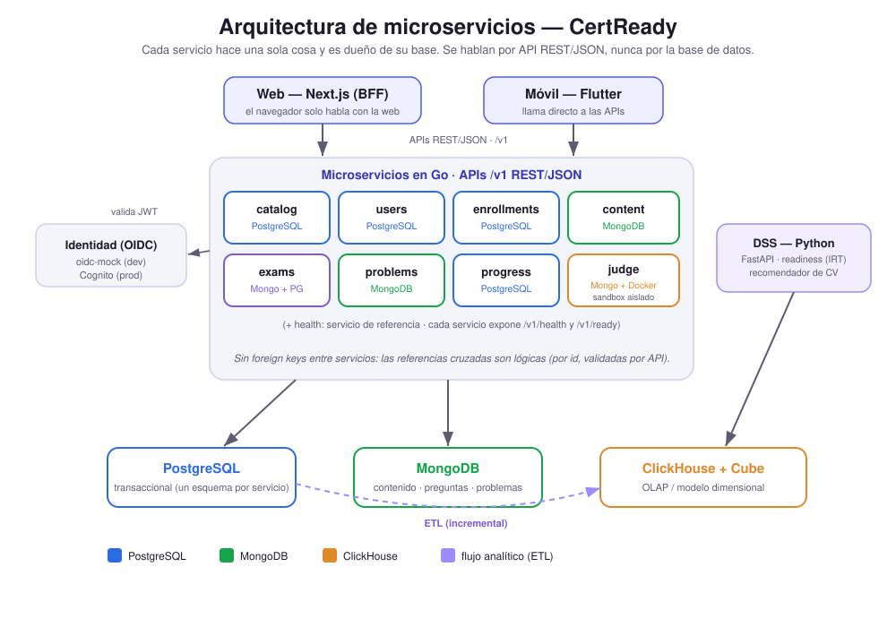
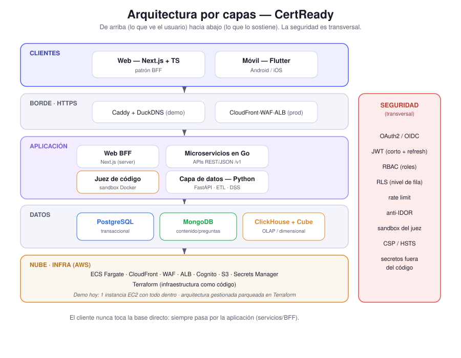
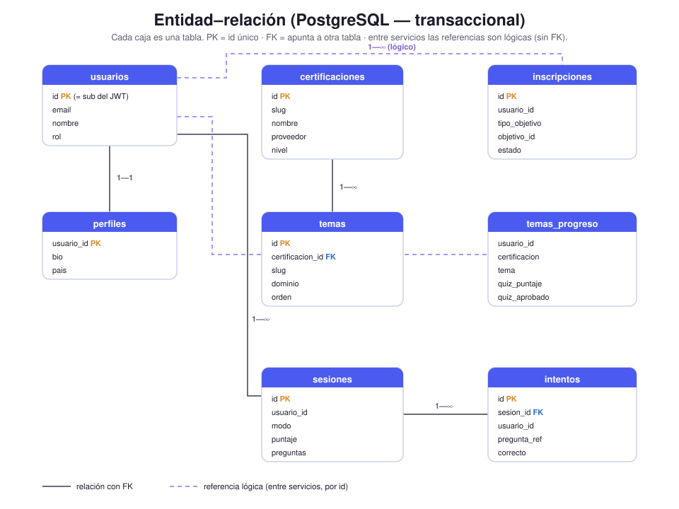
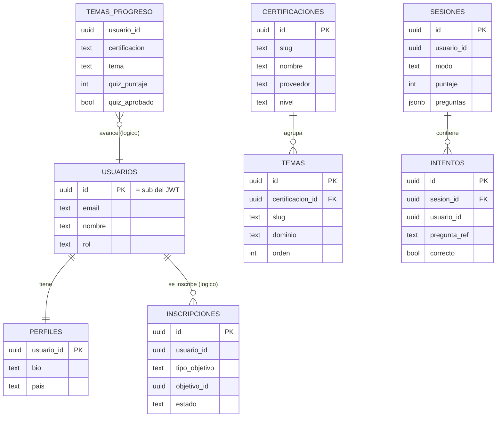
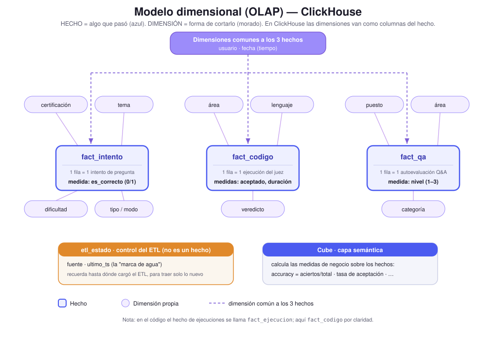
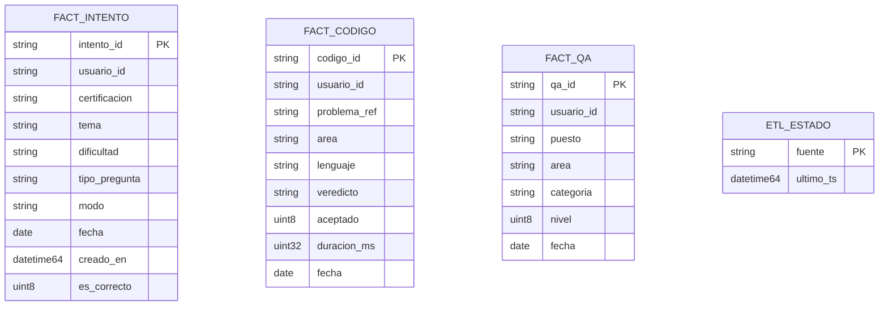

# Guía de presentación y estudio — CertReady

> Para estudiar la noche antes y defender el proyecto. Está escrita **para alguien que no es del área**: cada palabra rara se explica con una analogía. Si solo tienes 10 minutos, lee la sección **0 (pitch)**, la **3 (conceptos con analogías)** y la **7 (banco de preguntas)**.

---

## 0. El "pitch" de 60 segundos (apréndetelo casi de memoria)

> **CertReady es una plataforma web y móvil para prepararte para certificaciones técnicas (AWS, Azure, Google, etc.) y para entrevistas de programación.** Tiene material de estudio, exámenes de práctica que se sienten como el real, ejercicios de código que se califican solos, y una capa de analítica que mide tu desempeño y te dice qué tan listo estás para aprobar y qué te conviene estudiar después. Por dentro está construido como **un sistema profesional, desplegable en la nube (AWS)**: muchos servicios pequeños e independientes hechos en **Go**, una capa de datos en **Python** para la analítica, una web en **Next.js** y una app móvil en **Flutter**. Todo con seguridad de verdad (login, permisos, ejecución de código aislada) y desplegado en línea.

Si te piden una sola frase:
> "Es como un gimnasio para certificaciones: estudias, practicas, te mide y te dice cuándo estás listo — y por dentro está hecho con arquitectura de microservicios lista para producción."

---

## 1. ¿Qué es y qué hace? (lo esencial)

CertReady hace **dos cosas** sobre una misma base:

1. **Prepararte para certificaciones.** Eliges una certificación, sigues una **ruta de estudio** (tipo Duolingo: temas que se desbloquean uno tras otro) y presentas **simulacros** cronometrados con preguntas reales en formato, que te dan puntaje y repaso.
2. **Prepararte para entrevistas técnicas.** Resuelves **problemas de programación** (estilo LeetCode) que el sistema **ejecuta y califica solo**, y practicas **preguntas teóricas por puesto** (ej. "backend", "datos").

Encima de eso hay **inteligencia de datos**: mide cómo te va, calcula tu **probabilidad de aprobar**, te dice **qué estudiar después**, y hasta puede leer tu **CV** y recomendarte certificaciones.

**Plataformas:** una **web** y una **app móvil**, las dos usan el mismo "cerebro" (las mismas APIs).

---

## 2. El recorrido de la demo (qué mostrar y qué decir)

Lleva este orden; en cada paso tienes la frase para acompañar.

1. **Landing (página principal).** "Esta es la portada; está en línea en `certready.duckdns.org`, desplegada en AWS."
2. **Registro / login.** "El login usa un estándar de la industria, OIDC, el mismo que usan Google o los bancos. La contraseña nunca viaja en texto plano y la sesión va cifrada."
3. **Catálogo.** "Hay ~50 certificaciones de AWS, Azure, Google, CompTIA, Cisco, Kubernetes… Te inscribes con un clic."
4. **Estudiar (ruta tipo Duolingo).** "Cada tema tiene material y un mini-quiz que desbloquea el siguiente. El contenido es **original** (no copiamos guías oficiales)."
5. **Simulacro de examen.** "65 preguntas, cronometrado, con muestreo ponderado por dominio igual que el examen real, y al final te da el desglose por sección."
6. **Entrevistas → correr código.** "Escribes código en el editor, le das *Correr*, y el sistema lo ejecuta en una **caja aislada (sandbox)** y lo califica contra casos de prueba. Esto es lo más delicado en seguridad y lo resolvimos con contenedores endurecidos."
7. **Progreso / Preparación.** "Aquí está tu analítica **personal en vivo**: aciertos por tema, tendencia y qué tan listo estás (por certificación y por puesto). Esto es **plano operativo** y lo sirven los servicios Go directo sobre Postgres, al instante — no pasa por el almacén analítico." *(Si hay panel de admin: "y por separado, un dashboard de negocio con KPIs de toda la plataforma, ese sí desde el OLAP.")*
8. **Mi camino (CV).** "Subes tu CV y el sistema, con inteligencia artificial **local** (sin mandar tus datos a terceros), detecta tu perfil y te recomienda certificaciones."
9. **Móvil.** "La misma experiencia en una app Flutter para Android/iOS."

**Cierre:** "Todo esto está desplegado en AWS, con seguridad de producción, y construido por fases con pruebas en cada una."

---

## 3. Conceptos explicados con analogías (la parte clave para entenderlo)

Lee esto despacio. Cada concepto: **qué es**, **la analogía**, y **cómo lo decimos en la presentación**.

### 3.1 ¿Qué es una "arquitectura de software"?
Es **cómo están organizadas las piezas** de un sistema y cómo se hablan entre ellas. Como el plano de un edificio: dónde va la cocina, los baños, las tuberías. Una buena arquitectura hace que el sistema sea fácil de mantener, escalar y asegurar.

### 3.2 Frontend, Backend y Base de datos
- **Frontend** = lo que **ves y tocas** (la web, la app). La "cara".
- **Backend** = el **cerebro** que vive en un servidor: hace las reglas, los cálculos, decide qué guardar.
- **Base de datos** = el **almacén** donde se guarda todo (usuarios, preguntas, resultados).

> Frase: "El cliente (web/móvil) nunca toca la base de datos directo; siempre pasa por el backend. Eso es seguridad básica."

### 3.3 Cliente–servidor y API (REST/JSON)
- **Cliente** = quien pide (tu navegador). **Servidor** = quien responde (el backend).
- **API** = el **menú** del restaurante. Pides por el menú (no entras a la cocina) y te traen el plato. Cada platillo es un **endpoint** (una dirección como `/v1/certifications`).
- **REST/JSON** = el "idioma" en que se piden y entregan los datos. **JSON** es texto ordenado tipo ficha: `{ "nombre": "AWS", "nivel": "associate" }`.

> Frase: "Las APIs son REST/JSON y están versionadas (`/v1/...`) para no romper a los clientes cuando cambian."

### 3.4 Microservicios (vs. monolito)
- **Monolito** = **un solo empleado** que hace absolutamente todo. Si se cansa o se equivoca, se cae todo.
- **Microservicios** = **un equipo de especialistas**: uno solo cobra (catálogo), otro maneja usuarios, otro los exámenes… Cada uno hace **una cosa** y tiene **su propio archivero** (su base de datos). Si uno falla, los demás siguen.

CertReady tiene **8 servicios** (catálogo, usuarios, inscripciones, contenido, exámenes, problemas, progreso y el "juez" de código) + la capa de datos. Cada uno está hecho en **Go**.

> Frase: "Cada servicio es dueño de sus datos; nadie mete mano en el archivero ajeno. Si necesitan algo se lo piden por API, no por la base de datos."

*Cómo están los microservicios y la base que usa cada uno (azul = PostgreSQL, verde = MongoDB, ámbar = ClickHouse). Si no se ve, abre `docs/diagrams/microservicios.svg` en el navegador.*

### 3.5 Base de datos: SQL vs NoSQL, y nuestras tres
Usamos **la herramienta correcta para cada tipo de dato**:

- **PostgreSQL (SQL / relacional).** Como una **hoja de Excel muy estricta**: columnas fijas y reglas para que los datos **siempre cuadren**. La usamos para lo que **no puede fallar**: cuentas, inscripciones, intentos de examen. Garantiza **transacciones** (o se hace todo o no se hace nada — como una transferencia bancaria).
- **MongoDB (NoSQL / documental).** Como una **caja de fichas** donde cada ficha puede tener campos diferentes. La usamos para el **contenido variado**: preguntas de opción múltiple, problemas de código con sus casos de prueba, material de estudio. No todas las preguntas tienen la misma forma, por eso encaja mejor que Excel.
- **ClickHouse (columnar / analítica).** Una base de datos **especializada en analítica** que suma y promedia **millones de filas en un parpadeo**. La usamos para los **reportes de negocio** (KPIs de plataforma, gaps de contenido, retención de toda la población), no para el día a día ni para la vista personal del alumno (eso es operativo, ver 3.17).

**¿Qué es ClickHouse exactamente y por qué es tan rápida?** (en simple). Las bases normales como Postgres guardan los datos **por filas**: toda la información de un registro junta (ideal para "dame este intento completo"). ClickHouse guarda los datos **por columnas**: todos los "aciertos" juntos, todas las "fechas" juntas. Cuando quieres "el promedio de aciertos de la semana", solo necesita leer **esa columna** y procesarla de golpe, sin cargar lo demás — por eso vuela en reportes sobre millones de registros. A eso se le llama **base columnar**. Encima va **Cube**, que traduce esos números crudos a medidas de negocio listas para usar (accuracy = aciertos/total, tasa de aceptación, etc.). Es **OLAP**: pensada para analizar, no para el ajetreo transaccional del día a día. *(El diagrama de su modelo está en la sección 12.)*

> Frase: "Postgres para lo transaccional, Mongo para contenido heterogéneo, ClickHouse para analítica. Cada base donde aporta."

### 3.6 OLTP vs OLAP (el día a día vs. los reportes)
- **OLTP** (transaccional) = la **caja registradora**: una operación a la vez, rápida y exacta (guardar un intento de examen). Eso vive en **Postgres/Mongo**.
- **OLAP** (analítico) = el **reporte de fin de mes**: analizar TODAS las operaciones juntas (promedios, tendencias). Eso vive en **ClickHouse**.

> Frase: "Separamos los datos operativos de los analíticos para no frenar la app cuando alguien pide un reporte pesado."

### 3.7 Modelo dimensional / esquema estrella (el corazón del OLAP)
Para que los reportes sean rápidos y claros, los datos analíticos se organizan en **esquema estrella**:

- En el **centro**, una tabla de **hechos**: cada fila es **algo que pasó** (ej. "el usuario X respondió la pregunta Y y fue correcta, el día Z").
- Alrededor, las **dimensiones**: las formas de **cortar** ese hecho (por **quién**, por **tema**, por **dificultad**, por **fecha**, por **modo**).

Analogía: una **factura**. El "hecho" es la compra; las "dimensiones" son las etiquetas: cliente, producto, fecha, sucursal. Con eso puedes preguntar "ventas por sucursal en marzo" — o aquí, "**aciertos por dominio esta semana**".

Nuestros hechos: `fact_intento` (intentos de examen), `fact_ejecucion` (ejecuciones de código), `fact_qa` (autoevaluaciones de entrevista).

> Frase: "Modelo estrella: un hecho central (cada intento) rodeado de dimensiones (quién, qué tema, qué día). Así la analítica es rápida y se entiende."

### 3.8 ETL (cómo llegan los datos al almacén analítico)
**ETL = Extraer, Transformar, Cargar.** Es una **mudanza de datos**:
- **Extraer** los hechos de Postgres (intentos, ejecuciones).
- **Transformar**: limpiar y **etiquetar** (agregarle el tema, la dificultad, que vienen de Mongo).
- **Cargar** en ClickHouse, listo para reportes.

Lo hacemos **incremental** (solo lo nuevo, usando una "marca de agua"/*watermark* que recuerda hasta dónde quedó) e **idempotente** (si lo corres dos veces, no duplica nada).

> Frase: "El ETL mueve los hechos a ClickHouse de forma incremental e idempotente; corre seguido y nunca duplica."

### 3.9 Cube (la "capa semántica")
ClickHouse guarda números crudos. **Cube** es un **traductor** que define, en lenguaje de negocio, qué es "accuracy" (aciertos/total), "tasa de aceptación", etc., y lo expone como API. Así el frontend pide "dame la accuracy por tema" sin saber SQL.

> Frase: "Cube pone una capa semántica sobre ClickHouse: medidas y dimensiones listas para consumir, sin MDX, todo con SQL."

### 3.10 DSS e IRT (la "inteligencia" que estima si aprobarás)
- **DSS** = *Decision Support System* (sistema de apoyo a decisiones). Convierte los datos en **decisiones**: "estás 72% listo", "estudia este tema".
- **IRT** = *Item Response Theory* (teoría de respuesta al ítem). Es **psicometría real** (la matemática detrás de exámenes como el SAT). Su idea clave: separa **dos cosas**:
  - qué tan **difícil** es cada pregunta (según cómo le va a **todos**), y
  - qué tan **hábil** eres **tú**.
  Con eso estima tu probabilidad de acertar preguntas que **aún no has visto** → tu *readiness*.

Analogía: un buen instructor de manejo no cuenta cuántas veces fallaste; **modela** qué tan difícil era cada maniobra y qué tan bueno eres, y de ahí predice si pasarás el examen.

> Frase: "La readiness no es un número inventado: usa IRT (modelo Rasch), que separa dificultad del ítem de habilidad del alumno. Es defendible."

### 3.11 Autenticación vs Autorización — y OIDC, OAuth2, JWT, PKCE
Dos cosas distintas que la gente confunde:
- **Autenticación (AuthN)** = **¿quién eres?** (login).
- **Autorización (AuthZ)** = **¿qué puedes hacer?** (permisos).

Los tecnicismos:
- **OAuth2** = el **protocolo estándar** para dar acceso sin compartir tu contraseña (el "permitir que esta app use tu cuenta de Google").
- **OIDC** (OpenID Connect) = una **capa encima de OAuth2** que además dice **quién eres** (identidad). Es el estándar de login moderno.
- **JWT** (JSON Web Token) = el **brazalete del antro**: un pase firmado que llevas en cada petición. Está **sellado** (no se puede falsificar), dice quién eres y tus permisos, y **caduca** pronto (por eso hay un *refresh token* para renovarlo).
- **PKCE** = un **candado extra** en el flujo de login para que, si alguien intercepta tu "código de entrada", no le sirva sin la llave que solo tu app tiene.

> Frase: "Login con OIDC (lo mismo que Cognito de AWS en producción), tokens JWT cortos con refresh, y PKCE para que no roben el código de autorización."

### 3.12 BFF (Backend for Frontend) — cómo se conecta la web
**BFF = un mesero personal para el frontend.** El navegador **solo** habla con la web (Next.js); la web guarda tu sesión en una **cookie cifrada** y es ella quien va a los servicios con tu token, **del lado del servidor**. El navegador **nunca** ve un token de servicio ni una dirección interna.

Analogía: tú (navegador) solo hablas con tu mesero (la web). El mesero va a la cocina (los servicios) con tu orden y tus credenciales guardadas en su libreta cerrada. Tú nunca entras a la cocina.

> Frase: "Patrón BFF: el navegador solo ve la web; la web proxea a los microservicios inyectando el token de forma segura. Cero secretos en el cliente."

(En **móvil** no hace falta BFF, porque una app no es un navegador donde se puedan robar secretos fácil; llama directo a las APIs.)

### 3.13 El "juez de código" y el sandbox
Ejecutar **código que escribió un desconocido** es peligroso (podría intentar borrar archivos, robar datos, usar internet). Lo corremos en un **sandbox**: una **caja fuerte sin ventanas ni teléfono**.

Cada ejecución va en un **contenedor desechable** con: **sin red**, **disco de solo lectura**, **límites de memoria, CPU y tiempo**, **sin privilegios**. Si el código intenta algo raro, no puede salir ni romper nada, y se destruye al terminar. Además, las **respuestas esperadas de los casos ocultos nunca se le muestran** al usuario (anti-trampa).

> Frase: "El juez ejecuta el código en un contenedor Docker endurecido: sin red, solo lectura, límites estrictos. Tenemos hasta una suite de pruebas de *escape* del sandbox."

### 3.14 Contenedores / Docker
Un **contenedor** es una **cajita** que empaqueta un programa con **todo** lo que necesita (librerías, configuración) para que corra **igual en cualquier computadora**. **Docker** es la herramienta que crea y corre esas cajitas. Lo usamos para las bases de datos y para el sandbox del juez.

> Frase: "Todo va en contenedores: corre igual en mi laptop y en el servidor."

### 3.15 La nube, AWS, EC2, Terraform (IaC)
- **La nube** = computadoras de alguien más (Amazon) que rentas por internet.
- **AWS** = Amazon Web Services, el proveedor de nube más grande.
- **EC2** = una **computadora rentada** en AWS (una máquina virtual). Hoy **toda la app corre en una sola EC2** para la demo, a bajo costo.
- **Terraform / IaC** (*Infraestructura como Código*) = el **plano de la infraestructura escrito en código**. En vez de hacer clics en la consola de AWS, describes lo que quieres y con un comando se construye **igual siempre**. Lo tenemos escrito para la versión "grande" de producción (parqueada hasta tener presupuesto).

> Frase: "Hoy corre en una EC2 con todo dentro (a bajo costo); la versión de producción gestionada está escrita en Terraform, validada, lista para activar."

### 3.16 HTTPS / TLS / Caddy / DuckDNS
- **HTTPS/TLS** = la **versión segura** de las páginas (el candadito). Cifra lo que viaja entre tu navegador y el servidor.
- **Caddy** = un programa que pone ese candado automáticamente y reparte el tráfico (un *reverse proxy*).
- **DuckDNS** = un servicio **gratis** que nos dio el nombre bonito `certready.duckdns.org` en vez de un número de IP.

> Frase: "Caddy nos da HTTPS automático y DuckDNS el dominio; por eso la demo abre con candado y sin números raros."

### 3.17 Los dos planos: operativo (en vivo) vs analítico (de negocio)

Este es el concepto **más importante de toda la presentación** y el que más te hace ganar puntos: el sistema separa a propósito **dos mundos de datos** que parecen lo mismo pero no lo son.

- **Plano operativo (tiempo real, por-usuario).** Es **lo que el alumno ve de sí mismo en vivo**: su acierto por tema, su tendencia, qué tan listo está para una certificación, qué tan listo está para un puesto. Tiene que responder **al instante** y ser **siempre tuyo y al día**. Por eso lo sirven los **servicios Go directamente sobre PostgreSQL** (la base transaccional). Endpoints: `exams /v1/me/analytics` y `exams /v1/me/readiness` (acierto por tema, tendencia, preparación), `judge /v1/me/code/summary` (tus problemas por área), `progress /v1/me/job-readiness` (combina exámenes + código + Q&A llamando por HTTP a exams y judge) y `progress /v1/puestos` (catálogo de puestos).
- **Plano analítico (por lotes, agregado, para el negocio).** Es **lo que la plataforma necesita para tomar decisiones**: cuántos usuarios activos hay, qué temas son un cuello de botella para **todos**, dónde se está yendo la gente (retención). No es de una persona ni necesita ser al instante: se calcula **en bloque, periódicamente**. Por eso vive en el pipeline **ETL → ClickHouse (OLAP) → DSS**, y el DSS expone **solo endpoints de negocio**: `/v1/business/overview` (KPIs + actividad mensual), `/v1/business/areas` (gaps de contenido: temas difíciles con volumen) y `/v1/business/churn` (retención y abandono). Se consume desde un **dashboard de administración** en la web. El DSS también conserva `/v1/recommendations` (el recomendador de CV).

**La analogía clave (dila así):** el plano operativo es como **tu reloj deportivo**: te dice tu ritmo cardiaco **ahora**, al segundo, solo el tuyo. El plano analítico es como el **reporte que el dueño del gimnasio revisa cada mes**: cuántos socios vinieron, qué clases se llenan, quiénes dejaron de venir. Son **dos preguntas distintas** y por eso usan **máquinas distintas**.

**¿Por qué este replanteo?** Antes, esa analítica por-usuario (readiness, acierto por tema, preparación por puesto) se servía desde el **DSS leyendo ClickHouse**. Era un **error de diseño**: usábamos maquinaria **analítica y por lotes** (pensada para agregar millones de filas) para algo **operativo y en tiempo real** de **una sola persona**. Lo movimos al plano correcto: lo por-usuario ahora es **Go sobre Postgres** (rápido, fresco, dueño de sus datos), y el OLAP/ETL/DSS quedó **donde sí aporta**: agregación masiva para decisiones de plataforma.

> **Frase para defender:** "Separamos dos planos. El operativo —lo que el alumno ve de sí mismo en vivo— lo sirven los servicios Go sobre Postgres, al instante. El analítico —decisiones de negocio sobre todos los usuarios— va por ETL a ClickHouse y lo expone el DSS solo como KPIs. Antes mezclábamos los dos; ahora cada cosa corre en la máquina correcta."

**Cómo se logró técnicamente (por si preguntan):** se **denormalizó** la información que antes solo estaba en Mongo hacia las tablas operativas de Postgres: **tema y dificultad** en `exams.intentos`, **área** en `judge.ejecuciones` y **área** en `progress.qa_revisiones`. Así los servicios Go calculan acierto-por-tema y resúmenes-por-área **sin salir de su propia base**, sin tocar ClickHouse.

**Guion corto (30 segundos, defendible):**
> "Un alumno que mira su progreso no debería esperar a un proceso por lotes ni depender del almacén analítico: eso es operativo y en tiempo real, así que lo sirve Go directo sobre Postgres. En cambio, saber qué temas frenan a *toda* la población, o cuánta gente abandona, sí es agregación masiva: eso es lo que hace bien un OLAP. Por eso ahora el DSS solo expone KPIs de negocio para un dashboard de admin, y el recomendador de CV —que no es OLAP sino inferencia con embeddings— se queda aparte. La herramienta correcta para cada trabajo."

**Banco mini de preguntas tipo examen (sección 3.17):**
- **¿Por qué la readiness del alumno ya no sale del DSS/ClickHouse?** → Porque es un dato **operativo, por-usuario y en tiempo real**, no una agregación masiva. Usar el OLAP para eso era forzar una máquina por lotes a un caso de uso instantáneo. Ahora lo sirve Go sobre Postgres.
- **¿Qué sigue haciendo ClickHouse/ETL/DSS, entonces?** → El **plano analítico**: agregar a **todos** los usuarios para **decisiones de negocio** (KPIs, gaps de contenido, retención), que sí es por lotes y agregado. Ahí el OLAP brilla.
- **¿Qué endpoints son operativos y cuáles analíticos?** → Operativos (Go/Postgres): `exams /v1/me/analytics`, `exams /v1/me/readiness`, `judge /v1/me/code/summary`, `progress /v1/me/job-readiness`, `progress /v1/puestos`. Analíticos (DSS): `/v1/business/overview`, `/v1/business/areas`, `/v1/business/churn` (+ `/v1/recommendations`).
- **¿Cómo calcula Go el acierto por tema sin ClickHouse?** → Se **denormalizaron** tema/dificultad en `exams.intentos` y el área en `judge.ejecuciones` y `progress.qa_revisiones`; así cada servicio agrega sobre su propia base Postgres.
- **¿El recomendador de CV es OLAP?** → No. Es **inferencia ML** (embeddings), no agregación analítica; por eso es un servicio aparte (sigue en el DSS como `/v1/recommendations`), no parte del cubo.

### 3.18 Seguridad: RBAC, RLS, rate limit, IDOR
- **RBAC** = permisos **por rol**: un *estudiante* ve lo suyo; un *admin* puede crear contenido.
- **RLS** (*Row Level Security*) = que **la propia base de datos** solo te devuelva **tus** filas, **aunque el programa se equivocara**. Doble candado.
- **Rate limit** = **tope de peticiones** por minuto, para frenar abusos/fuerza bruta.
- **IDOR** = el bug clásico de "**cambio el número en la URL y veo lo de otra persona**". Lo prevenimos validando dueño en cada petición (y con RLS).

> Frase: "Defensa en profundidad: permisos por rol, seguridad a nivel de fila en la base, límites de tasa, y validación anti-IDOR en cada endpoint."

---

## 4. Las tecnologías y POR QUÉ cada una

Esta es **la pregunta estrella** ("¿por qué Go?", "¿por qué no todo en un lenguaje?"). Respuestas cortas y firmes:

| Tecnología | Para qué | Por qué esa |
|---|---|---|
| **Go** | Los servicios del backend | Programas **diminutos y rapidísimos de arrancar**, excelente para **muchas cosas a la vez** (concurrencia), barato de desplegar. **Un solo lenguaje de servicios** = menos cosas que mantener. |
| **Python** | Solo la capa de datos (ETL, analítica, IA) | Es **el** lenguaje de datos e IA; tiene las librerías de embeddings y numérico. Lo acotamos **solo ahí**. |
| **Next.js / TypeScript** | La web | Estándar moderno para web, rápido, con tipado que evita errores. |
| **Flutter / Dart** | La app móvil | **Un solo código** para Android **e** iOS. |
| **PostgreSQL** | Datos que deben cuadrar | Relacional, transacciones ACID, integridad. |
| **MongoDB** | Contenido variado | Documental, esquemas flexibles. |
| **ClickHouse + Cube** | Analítica | Velocidad columnar + capa semántica. |

**La filosofía** (dilo así): *"Políglota con disciplina: la herramienta correcta para cada trabajo, pero sin caos. Un solo lenguaje de servicios (Go), y Python **solo** en datos."*

**¿Por qué Go y no Python/Java para los servicios?** Go genera un **ejecutable único y minúsculo** que arranca en milisegundos y aguanta mucha concurrencia con poca memoria → **contenedores chicos y despliegue barato** en la nube. Java pesa más al arrancar; Python no es ideal para servicios concurrentes y queríamos reservarlo para datos.

---

## 5. Cómo encajan: el viaje de una petición (paso a paso)

Tres ejemplos que puedes contar como historia.

**A. "Inicio sesión":** escribes correo/contraseña → la **web (BFF)** los manda al emisor **OIDC** → te regresa un **JWT** → la web lo guarda en una **cookie cifrada** → al entrar al panel, la web pide tus datos al servicio **users** con ese token (y si es tu primer login, te **crea** la cuenta automáticamente).

**B. "Presento un examen":** la web pide a **exams** un simulacro → exams **muestrea** preguntas de **Mongo** ponderando por dominio y crea la sesión en **Postgres** (sin mandarte las respuestas correctas) → respondes → exams **califica del lado del servidor** y guarda tus intentos → cuando entras a **Progreso**, exams calcula tu **acierto por tema, tendencia y readiness** desde **Postgres** y te lo da **en vivo** (`/v1/me/analytics`, `/v1/me/readiness`). En paralelo, esos mismos intentos viajan por el **ETL** a **ClickHouse** para la **analítica de negocio** (no para tu vista personal).

**C. "Corro código":** escribes en el editor → va al **juez** → el juez lee el problema y sus casos de **Mongo** → ejecuta tu código en un **contenedor sandbox** por cada caso → compara con la salida esperada → te da el veredicto (sin filtrar los casos ocultos) y guarda la **ejecución** en **Postgres** (con su **área**, denormalizada). Tu resumen de problemas por área lo da el juez en vivo (`/v1/me/code/summary`).

---

## 6. Mapa del código: ¿dónde está cada cosa?

Para responder "¿en dónde va tal cosa?". Carpeta → qué hace.

| Carpeta | Qué vive ahí |
|---|---|
| `services/` | Los **8 microservicios en Go**, uno por carpeta: `catalog`, `users`, `enrollments`, `content`, `exams`, `problems`, `progress`, `health`. |
| `services/<x>/cmd/server` | El **arranque** del servicio (su `main`). |
| `services/<x>/internal/httpapi` | Las **rutas/endpoints** y los *handlers* (qué responde cada dirección). |
| `services/<x>/internal/store` | El acceso a la **base de datos** de ese servicio. |
| `services/<x>/migrations` | Los **scripts SQL** que crean sus tablas (y las *policies* de RLS). |
| `judge/` | El **juez de código** (la lógica del sandbox y la calificación). |
| `judge/internal/runner` | El que **ejecuta** el código en Docker (los flags de seguridad). |
| `libs/platform/` | La **librería compartida** por todos los servicios: middleware HTTP, pool de Postgres, validación de **JWT/OIDC**, RLS. |
| `tools/oidc-mock/` | El **emisor de login** para desarrollo (sustituye a Cognito en local). |
| `data/etl/` | El **ETL** (mover hechos a ClickHouse). |
| `data/cube/` | La **capa semántica** Cube (medidas/dimensiones). |
| `data/dss/` | El **DSS** (plano analítico de negocio): `api.py` (endpoints `/v1/business/*` de KPIs/gaps/retención), el modelo **IRT** que alimenta esos agregados, y `recomendador.py` (CV con IA). |
| `web/app/` | Las **páginas** de la web (landing, panel, estudiar, exámenes…). |
| `web/app/api/` | Las **rutas BFF** (lo que el navegador llama; la web proxea a los servicios). |
| `web/lib/` | Sesión cifrada, validación de entorno, clientes tipados de los servicios. |
| `web/components/` | Piezas visuales (sidebar, editor de código, gráficas…). |
| `mobile/lib/` | La **app Flutter**: `core` (config/auth/red), `features` (pantallas). |
| `infra/` | **Terraform** (la infraestructura como código). |
| `scripts/` | `dev-up` (levantar todo en local), `ec2-up` (desplegar en la EC2), y los *seeders* (cargar contenido). |
| `docs/` | Toda la documentación (arquitectura, fases, esta guía). |

> Si te preguntan "¿dónde está la seguridad?": en `libs/platform/auth` (valida los JWT) y `libs/platform/postgres` (la RLS), más las *migrations* `*_rls.sql` de cada servicio.

> Si te preguntan "¿dónde está la IA del CV?": en `data/dss/recomendador.py` (usa embeddings ONNX locales).

### 6.1 ¿Dónde está la seguridad? (archivo por archivo)

| Qué protege | Dónde en el código | Cómo funciona (en breve) |
|---|---|---|
| **Validar el login (JWT/OIDC)** | `libs/platform/auth` | Verifica la **firma**, el emisor y la **caducidad** del token. `Middleware` exige token; `RequireRole` exige rol. Cada servicio lo activa en `services/<x>/internal/httpapi/router.go`. |
| **Permisos por rol (RBAC)** | `libs/platform/auth` (`RequireRole`) + los routers (`adminGate`) | Los endpoints de administración exigen el rol `admin` que viene en el token. |
| **Seguridad a nivel de fila (RLS)** | `libs/platform/postgres` (`RLSTx`, `Q`) + migraciones `*_rls.up.sql` en `enrollments`, `progress`, `exams` | Cada petición abre una transacción y fija `app.usuario_id`; la **base** solo devuelve tus filas, aunque el código fallara. |
| **Tope de peticiones (rate limit) — servicios** | `libs/platform/httpx/ratelimit.go` | "Cubo de fichas" por IP; responde **429** si te pasas. Se aplica en cada `services/<x>/cmd/server/main.go`. |
| **Tope de peticiones — login web** | `web/lib/rate-limit.ts`, usado en `web/app/api/auth/login/route.ts` y `register/route.ts` | Frena la **fuerza bruta** en el login. |
| **Tope de tamaño del cuerpo** | `libs/platform/httpx/bodylimit.go` (1 MiB) | Evita payloads gigantes. El **CV** se lee acotado en `data/dss/api.py` + `recomendador.py`. |
| **Cabeceras de seguridad (CSP, HSTS, …)** | `web/next.config.mjs` | Se envían en **todas** las respuestas de la web. |
| **Sesión cifrada (cookie)** | `web/lib/auth/session.ts` (iron-session) + `web/lib/auth/guard.ts` | La sesión viaja **cifrada**; `requireSession()` protege cada página. |
| **Contraseñas con bcrypt** | `tools/oidc-mock` (tabla `idp_users`) | Nunca se guardan en texto plano. |
| **Sandbox del juez** | `judge/internal/runner/docker.go` (los flags) + `judge/internal/judge/calificar.go` (anti-fuga) | Contenedor **sin red, solo lectura, con límites**. Pruebas de *escape* en `judge/internal/runner/`. |
| **Anti-IDOR (no ver lo ajeno)** | `services/<x>/internal/httpapi/handlers.go` + RLS | Cada endpoint valida que **seas el dueño** del recurso. |
| **Secretos fuera del código** | variables de entorno (validadas en `web/lib/env.ts`); en prod **AWS Secrets Manager** (`infra/modules/secrets`) | Cero secretos en el repositorio. |

> Resumen para decir: *"La seguridad vive sobre todo en la librería compartida `libs/platform` (auth, RLS, rate-limit) y en `web/lib` (sesión, headers); el sandbox en `judge/internal/runner`."*

### 6.2 ¿Dónde se conectan las bases de datos (Mongo y Postgres)?

- **PostgreSQL** → se conecta en **`libs/platform/postgres`** (función `Connect`, que crea un *pool* de conexiones). Cada servicio la llama en su **`cmd/server/main.go`** usando la variable `<SERVICIO>_DATABASE_URL` (p. ej. `CATALOG_DATABASE_URL`). El **valor** de esa URL lo ponen los scripts `scripts/dev-up.ps1` (local) y `scripts/ec2-up.sh` (servidor).
- **MongoDB** → se conecta en **`libs/platform/mongo`** (función `Connect`). La usan los servicios que guardan contenido: **`content`, `exams`, `problems` y `judge`**, también en su `cmd/server/main.go`, con la variable `<SERVICIO>_MONGO_URI`.
- **Clave:** el **cliente (web/móvil) nunca se conecta a la base**; solo los servicios lo hacen, y cada servicio a la suya.

### 6.3 ¿En dónde se conecta y cómo se usa ClickHouse?

- **Solo Python toca ClickHouse** (Go **no** se conecta a ClickHouse). Se **escribe** desde el ETL en **`data/etl/load.py`** y se **lee** desde el DSS en **`data/dss/repo.py`**, con el driver `clickhouse-connect` y las variables `CLICKHOUSE_*` (configuración en `data/dss/config.py` y `data/etl/config.py`).
- **Cómo se usa:** el ETL **carga** los hechos (intentos, código, Q&A) en las tablas `fact_*`; el DSS los **lee** para calcular la readiness; y **Cube** (`data/cube`) los expone como medidas. ClickHouse corre en Docker (`data/docker-compose.yml`).

### 6.4 ¿Cómo se conecta Python con Go? (no se llaman directo)

Go y Python **no se llaman entre sí** ni comparten código. Se conectan de **dos formas**:

1. **Por las bases de datos.** Los servicios **Go** guardan los hechos en Postgres (`exams.intentos`, `judge.ejecuciones`, `progress.qa_revisiones`, con tema/dificultad/área **denormalizados**). El **ETL de Python** (`data/etl`) los **lee** de ahí (y de Mongo) y los lleva a ClickHouse para la **analítica de negocio**.
2. **Por HTTP.** La **web (BFF)** llama al **DSS de Python** igual que llama a los servicios Go (variable `DSS_BASE_URL`), pero ahora **solo para el dashboard de negocio** (`/v1/business/*`) y el **recomendador de CV** (`/v1/recommendations`). La analítica **por-usuario en vivo** ya **no** pasa por el DSS: la sirve Go directo.

> Frase: *"Go **produce** los datos y además sirve la analítica **por-usuario en vivo** desde Postgres; Python los **agrega** para decisiones de negocio. Se comunican por la base (vía el ETL) y la web habla con ambos por HTTP — nunca se llaman directo."*

### 6.5 ¿Dónde están los contenedores y dónde está el sandbox?

- **Contenedores (Docker):** las **bases de datos** corren en contenedores — Postgres (`cr-pg`), MongoDB (`cr-mongo`) y ClickHouse (definido en `data/docker-compose.yml`). Los **levantan** los scripts `scripts/dev-up.ps1` (local) y `scripts/ec2-up.sh` (servidor).
- **El sandbox del juez:**
  - La **imagen** donde corre el código del usuario está en **`judge/runners/python/`** (un `Dockerfile`).
  - El código que **lanza un contenedor efímero por cada ejecución** (con los flags de seguridad: sin red, solo lectura, límites) está en **`judge/internal/runner/docker.go`**.
  - Usa el **Docker del host** (no "Docker dentro de Docker"): por cada caso de prueba crea un contenedor, ejecuta, lee el resultado y lo destruye.

### 6.6 ¿Cómo se conecta Go con Next (la web)?

La web (Next.js) llama a los servicios **Go por HTTP** (patrón BFF):

- Las **direcciones** de cada servicio son variables de entorno, validadas en **`web/lib/env.ts`** (`CATALOG_BASE_URL`, `USERS_BASE_URL`, `EXAMS_BASE_URL`, `DSS_BASE_URL`, …).
- El **cliente HTTP** que hace la llamada está en **`web/lib/api/client.ts`** (añade el token `Authorization: Bearer`), y las **funciones tipadas** por servicio en **`web/lib/api/services.ts`**.
- Quién llama: las **rutas BFF** en `web/app/api/*/route.ts` y los *server components* de las páginas (`web/app/...`). El **token** sale de la cookie de sesión (`web/lib/auth/session.ts`).

> Frase: *"El navegador solo habla con Next; Next habla con los servicios Go por HTTP, poniendo el token que guarda en la cookie de sesión. Por eso el cliente nunca ve un secreto ni una dirección interna."*

---

## 7. Banco de preguntas (lo que te pueden preguntar)

Respuestas cortas y seguras. Practica decirlas en voz alta.

### Generales
- **¿Qué es CertReady?** → Plataforma web y móvil para preparar certificaciones y entrevistas técnicas, con analítica que estima tu probabilidad de aprobar.
- **¿Está funcionando de verdad?** → Sí, desplegada en AWS, en línea, con web y móvil sobre las mismas APIs.
- **¿Lo hiciste solo / cómo lo organizaste?** → Construido **por fases** (0 a 7), cada fase con un criterio de salida y pruebas antes de avanzar.

### Lenguajes / tecnología
- **¿Por qué Go?** → Binarios chicos, arranque en milisegundos, gran concurrencia, despliegue barato. Un solo lenguaje de servicios para no fragmentar.
- **¿Por qué no todo en un lenguaje?** → "Políglota con disciplina": cada herramienta donde aporta. Go en servicios, Python **solo** en datos, TypeScript en web, Dart en móvil.
- **¿Por qué Python solo en datos?** → Porque ahí están las librerías de IA/numérico; meterlo en el path del cliente lo haría más lento y caro de operar.

### Arquitectura
- **¿Qué es un microservicio y por qué los usaste?** → Servicios pequeños e independientes, cada uno dueño de sus datos. Fronteras limpias, se despliegan/escalan por separado, y si uno falla los demás siguen.
- **¿Cómo se comunican los servicios?** → Por **API REST/JSON** (no comparten base de datos). Las referencias entre dominios son **lógicas** (por id), validadas por API; **no hay foreign keys cruzadas**.
- **¿Qué es BFF?** → *Backend for Frontend*: el navegador solo habla con la web, y la web proxea a los servicios con el token guardado de forma segura. El cliente nunca ve secretos.
- **¿Monolito o microservicios, y por qué no monolito?** → Microservicios; el monolito es más simple al inicio pero acopla todo y se vuelve difícil de mantener/escalar; queríamos algo realista de producción.

### Datos
- **¿Por qué tres bases de datos distintas?** → Cada tipo de dato tiene su herramienta: Postgres (relacional, transaccional), Mongo (contenido variado), ClickHouse (analítica veloz).
- **¿Cómo funciona Postgres aquí?** → Guarda lo que debe cuadrar (cuentas, inscripciones, intentos) con integridad y transacciones; un esquema por servicio.
- **¿Cómo funciona Mongo aquí?** → Guarda contenido heterogéneo (preguntas de distintos tipos, problemas con casos, material) como documentos flexibles.
- **¿Qué es OLAP / el modelo dimensional?** → OLAP es analítica; usamos **esquema estrella**: una tabla de **hechos** (cada intento) rodeada de **dimensiones** (quién, tema, fecha…). Permite reportes rápidos.
- **¿Qué es ETL?** → Extraer-Transformar-Cargar: mueve los hechos de Postgres a ClickHouse, etiquetándolos; incremental e idempotente.
- **¿Qué es el DSS?** → Sistema de apoyo a decisiones del **plano analítico**: agrega a **todos** los usuarios (desde ClickHouse) para **decisiones de negocio** —KPIs, gaps de contenido, retención— y expone el **recomendador de CV**. La readiness **por-usuario en vivo** ya **no** la sirve el DSS, sino Go sobre Postgres (ver 3.17).
- **¿Por qué la analítica por-usuario salió del DSS?** → Porque es **operativa y en tiempo real**, no agregación por lotes. El OLAP/DSS quedó solo para **decisiones de plataforma**; cada cosa en su plano (ver 3.17).
- **¿Qué es IRT en una frase?** → Matemática de exámenes que separa la **dificultad** de la pregunta de la **habilidad** del alumno para predecir su desempeño.

### Seguridad
- **¿Qué es OIDC/OAuth2/JWT?** → OAuth2 da acceso sin compartir contraseña; OIDC añade identidad (login); JWT es el pase firmado y con caducidad que llevas en cada petición.
- **¿Qué es PKCE?** → Una protección extra para que nadie reuse tu código de autorización si lo intercepta.
- **¿Cómo evitas que un alumno vea datos de otro (IDOR)?** → Validación de dueño en cada endpoint **y** RLS en la base (la BD solo devuelve tus filas).
- **¿Y el código malicioso del usuario?** → Sandbox: contenedor sin red, solo lectura, límites de CPU/memoria/tiempo, sin privilegios. Probado con una suite de *escape*.
- **¿Dónde guardas las contraseñas/secretos?** → Las contraseñas con **bcrypt** (hash, no texto); los secretos fuera del código (variables de entorno / Secrets Manager).

### Despliegue / operación
- **¿Dónde está desplegado?** → En AWS, hoy en una sola instancia **EC2** con todo dentro (Docker para bases y juez), detrás de **Caddy** (HTTPS) y dominio **DuckDNS**.
- **¿Por qué una sola caja y no la arquitectura gestionada?** → Por **costo**: la versión gestionada (ECS Fargate, RDS, etc.) está escrita en **Terraform** y validada, pero se activa con presupuesto. El mismo código sirve a ambas.
- **¿Qué es CI/CD?** → Una línea de ensamblaje automática: ante cada cambio, corre **lint y pruebas** (Go, Python, web, y la suite del sandbox) antes de integrar.
- **¿Cómo pruebas que funciona?** → Pruebas unitarias y de integración **contra bases reales** (Postgres/Mongo/ClickHouse) y la suite de escape del sandbox con Docker, en cada fase.

### Preguntas "trampa" / difíciles
- **¿Esto escala?** → Sí: microservicios sin estado, escalables por separado; la analítica está separada del path operativo; en producción van detrás de balanceador y autoescalado (ruta Fargate).
- **¿Qué es lo más difícil que resolviste?** → El **juez de código** (ejecutar código no confiable de forma segura) y la **optimización móvil** de la web (scroll fluido sin sacrificar el diseño).
- **¿El contenido es legal?** → Sí: contenido **original**, sin copiar guías oficiales ni "brain dumps", y **sin logos** de terceros (identidad propia). Hay un aviso de marcas.
- **¿Usaste IA y dónde?** → Sí, en el recomendador de CV: **embeddings locales (ONNX)**, que corren en nuestra máquina; **el CV no se guarda ni se manda a terceros** (privacidad).
- **Si se cae la analítica, ¿se cae la app?** → No. El DSS **degrada con elegancia**: si ClickHouse no responde, las vistas siguen funcionando sin los números analíticos.
- **¿Qué falta?** → Pulir la app móvil (login nativo de Cognito, iOS, tiendas) y activar la ruta de producción gestionada cuando haya presupuesto.

---

## 8. Glosario relámpago (una línea cada uno)

| Término | En una frase |
|---|---|
| **API** | El "menú" para pedir datos al backend sin entrar a la cocina. |
| **Endpoint** | Una dirección concreta de la API (ej. `/v1/certifications`). |
| **REST/JSON** | El estilo e idioma de las APIs (texto ordenado tipo ficha). |
| **Microservicio** | Un servicio pequeño que hace una sola cosa y tiene sus datos. |
| **Monolito** | Un solo programa que hace todo (lo contrario de microservicios). |
| **Frontend / Backend** | La cara que ves / el cerebro en el servidor. |
| **BFF** | La web actúa de "mesero": el navegador solo habla con ella. |
| **PostgreSQL** | Base relacional (tipo Excel estricto) para datos que deben cuadrar. |
| **MongoDB** | Base documental (caja de fichas) para contenido variado. |
| **ClickHouse** | Base columnar súper rápida para analítica. |
| **OLTP / OLAP** | Operativo (caja registradora) / analítico (reportes). |
| **Esquema estrella** | Hecho central + dimensiones alrededor. |
| **ETL** | Extraer–Transformar–Cargar datos al almacén analítico. |
| **Cube** | Capa que traduce los datos crudos a medidas de negocio. |
| **DSS** | Sistema que convierte datos en decisiones/recomendaciones. |
| **IRT** | Modelo de exámenes: dificultad del ítem vs. habilidad del alumno. |
| **AuthN / AuthZ** | Quién eres / qué puedes hacer. |
| **OAuth2 / OIDC** | Estándar de acceso / capa de identidad encima. |
| **JWT** | Pase firmado y con caducidad que llevas en cada petición. |
| **PKCE** | Candado extra del login para no robar el código. |
| **RBAC** | Permisos por rol (estudiante/admin). |
| **RLS** | La base solo te muestra tus propias filas. |
| **IDOR** | Bug de "cambio el id en la URL y veo lo ajeno" (lo prevenimos). |
| **Rate limit** | Tope de peticiones para frenar abusos. |
| **Sandbox** | Caja aislada para correr código no confiable. |
| **Docker / contenedor** | Cajita que empaqueta un programa para que corra igual donde sea. |
| **AWS / EC2** | Nube de Amazon / una computadora rentada en ella. |
| **Terraform / IaC** | El plano de la infraestructura escrito en código. |
| **CI/CD** | Línea automática que prueba y publica el código. |
| **HTTPS / TLS** | La versión cifrada y segura de la web (el candadito). |
| **Caddy / DuckDNS** | Da el HTTPS automático / da el nombre de dominio. |
| **bcrypt** | Forma segura de guardar contraseñas (hash, no texto). |
| **Embeddings (ONNX)** | Representación numérica de texto para comparar perfiles (IA local). |

---

## 9. Datos para impresionar (suéltalos con naturalidad)

- **8 microservicios en Go** + capa de datos en Python + web Next.js + móvil Flutter.
- **3 bases de datos** especializadas: PostgreSQL, MongoDB, ClickHouse.
- **~50 certificaciones** (AWS, Azure, Google, CompTIA, Cisco, Kubernetes, HashiCorp…).
- **Modelo psicométrico IRT** para la readiness (no un porcentaje inventado).
- **Sandbox endurecido** con suite de pruebas de *escape*.
- **Seguridad de producción**: OIDC + JWT + PKCE, RBAC, RLS, rate limiting, headers, anti-IDOR.
- **Desplegado en AWS** con HTTPS, en línea, web + móvil con las mismas APIs.
- **Construido por fases** con pruebas (unitarias + integración contra bases reales) e **infra como código** (Terraform).

---

## 10. Si algo falla en vivo (plan B)

- Si la EC2 va lenta o se cae: ten **capturas/un video** del recorrido como respaldo. Di: "está corriendo en una sola instancia económica para la demo; en producción va detrás de balanceador y autoescalado".
- Si el juez de código tarda: "la primera ejecución crea el contenedor; las siguientes son rápidas".
- Si no carga la analítica: "el DSS degrada con elegancia; la app funciona sin los números — es a propósito".
- Si te preguntan algo que no sabes: **no inventes**. Di "esa parte está en [tal capa]; el diseño está documentado en el repo (README y docs)". Suena profesional y es verdad.

---

## 11. El sistema por capas (mapa para tu póster/diapositiva)

> Esta es la organización del sistema **por capas** — justo lo que pondrías en una diapositiva de arquitectura. Cada pieza con una línea de "qué es / para qué". Léela de arriba (lo que ve el usuario) hacia abajo (lo que lo sostiene).

*Las capas del sistema y la seguridad transversal. Abajo el detalle de cada pieza.*

### 🧑‍💻 Clientes (lo que usa la gente)
| Componente | Qué es / para qué |
|---|---|
| **Web — Next.js + TypeScript** | La página web. *TypeScript* = JavaScript con "tipos" (avisa de errores antes de correr). *Next.js* = el framework de React para web rápida. |
| **Móvil — Flutter** | La app para **Android e iOS con un solo código** (lenguaje Dart). |

### 🗄️ Bases de datos y analítica
| Componente | Qué es / para qué |
|---|---|
| **PostgreSQL** | Datos **transaccionales** (cuentas, inscripciones, intentos): los que **deben cuadrar siempre**. |
| **MongoDB** | **Contenido, preguntas y problemas**: documentos flexibles porque cada uno tiene forma distinta. |
| **ClickHouse + Cube** | **Modelo dimensional / OLAP**: reportes y analítica rapidísimos (ver sección 3.5 y 12). |

### ⚙️ Servicios (el backend)
| Componente | Qué es / para qué |
|---|---|
| **Microservicios en Go** | 8 servicios pequeños e independientes, cada uno dueño de sus datos. |
| **APIs REST/JSON versionadas** | El "idioma" entre las piezas; versionadas (`/v1/...`) para no romper a los clientes al cambiar. |

### 🐍 Capa de datos
| Componente | Qué es / para qué |
|---|---|
| **Python: ETL, OLAP y DSS** | El **único** lugar con Python: mover datos (ETL), analítica (OLAP) y decisiones (DSS). |
| **FastAPI** | El framework con el que está hecho el **DSS** (permite crear APIs en Python de forma rápida y tipada). |

### 🧠 Algoritmos
| Componente | Qué es / para qué |
|---|---|
| **IRT Rasch — calibrado por población** | Estima tu **readiness** (probabilidad de aprobar) separando la **dificultad** de cada pregunta de **tu habilidad**. "Calibrado por población" = la dificultad sale de cómo le va a **todos**. |
| **Embeddings locales (ONNX) — recomendador de CV** | Convierte tu CV en **números** para compararlo con las certificaciones. *Embeddings* = representación numérica del texto; *ONNX* = formato del modelo de IA que corre **local** (sin enviar tu CV a terceros). |
| **Optimiza tu CV** | El resultado para el usuario: detecta tu **perfil, tus habilidades** y las **certificaciones que mejor te encajan**. |

### 🔒 Seguridad
| Componente | Qué es / para qué |
|---|---|
| **OAuth2 / OIDC** | Estándar de **acceso e identidad** (el mismo de Google/bancos). OAuth2 da acceso sin compartir contraseña; OIDC añade "quién eres". |
| **JWT** | El **pase firmado y con caducidad** que llevas en cada petición (no se puede falsificar). |
| **RBAC** | **Permisos por rol** (estudiante ve lo suyo; admin gestiona contenido). |
| **Juez de código en sandbox Docker aislado** | Ejecuta el código del usuario en una **caja sin red, de solo lectura y con límites** de CPU/memoria/tiempo. No puede salir ni romper nada. |

### ☁️ Nube e infraestructura (AWS)
| Componente | Qué es / para qué |
|---|---|
| **ECS Fargate** | Corre **contenedores sin** que tengas que administrar servidores. |
| **CloudFront** | **CDN**: entrega el sitio rápido desde el punto más cercano al usuario y cachea. |
| **WAF** | **Firewall de aplicaciones web**: bloquea ataques comunes (inyección, bots). |
| **ALB** | **Balanceador de carga**: reparte el tráfico entre varias instancias. |
| **Cognito** | El **login gestionado** de AWS (OIDC). En producción **reemplaza** al emisor OIDC local. |
| **S3** | **Almacén de archivos/objetos** (imágenes, recursos estáticos). |
| **Secrets Manager** | **Bóveda de secretos** (contraseñas, llaves) — fuera del código. |
| **Terraform** | **Infraestructura como código**: el "plano" de todo lo anterior, reproducible con un comando. |

> **Nota honesta para defender:** la **demo en vivo** corre hoy en **una sola EC2** (por costo). Esta lista de servicios AWS (Fargate, CloudFront, WAF, ALB, Cognito, S3, Secrets Manager) es la **arquitectura de producción**: está escrita en **Terraform** y validada, lista para activar cuando haya presupuesto. El **mismo código** sirve a ambas. Si te preguntan, esa es la respuesta: *"diseñado para esa arquitectura gestionada; desplegado hoy en una caja por costo, sin cambiar el código."*

---

## 12. Diagramas: entidad–relación y dimensional

Dos maneras de ver los datos: el **entidad–relación (ER)** del mundo **transaccional** (cómo se relacionan usuarios, certificaciones, exámenes…) y el **dimensional** de la **analítica** (hechos + dimensiones).

### 12.1 Entidad–relación (PostgreSQL — transaccional)

**Cómo leerlo:** cada caja es una **tabla**; las líneas son **relaciones**. `||--o{` se lee *"uno a muchos"* (un usuario tiene muchas inscripciones). `PK` = llave primaria (identificador único de la fila); `FK` = llave foránea (apunta a otra tabla). Importante: entre **servicios distintos no hay FK** — esas referencias son **lógicas** (se guarda el id y se valida por API).

**Para explicarlo en voz:** *"Un usuario tiene un perfil y muchas inscripciones; una certificación agrupa muchos temas; una sesión de examen contiene muchos intentos. Cada servicio es dueño de sus tablas y entre servicios las referencias son lógicas, no foreign keys."*

### 12.2 Dimensional (ClickHouse — analítica / esquema estrella)

**Cómo leerlo:** en analítica no se dibujan relaciones con líneas; hay **tablas de hechos**, donde **cada fila es algo que pasó**, y las **dimensiones van denormalizadas como columnas** (quién, qué tema, qué día). Hay **tres hechos**: `fact_intento` (intentos de examen), `fact_codigo` (ejecuciones de código en el juez) y `fact_qa` (autoevaluaciones de entrevista). `etl_estado` guarda hasta dónde llegó el ETL (la "marca de agua").

**Para explicarlo en voz:** *"Esto es un esquema estrella: tablas de hechos (cada intento, cada ejecución de código, cada autoevaluación) con sus dimensiones como columnas. Sobre ellas, Cube calcula las medidas (accuracy, tasa de aceptación) y el DSS estima la readiness."*

> *Detalle por si revisan la base:* en el código esa tabla de ejecuciones de código se llama `fact_ejecucion` ("ejecucion" = ejecución). Aquí la mostramos como **`fact_codigo`** por claridad.

---

### Cómo estudiar esto esta noche
1. Lee la **sección 0** (pitch) y repítela hasta que salga sola.
2. Lee la **3** (analogías) — es lo que te hace **entender**, no solo memorizar.
3. Repasa la **4** (por qué cada tecnología) y la **7** (preguntas) en voz alta.
4. Ojea la **6** (mapa del código) y la **11** (capas) por si preguntan "¿dónde está X?".
5. Mira los **diagramas (12)** y el **glosario (8)** — tu acordeón de último minuto.

Mucha suerte. Lo tienes.
