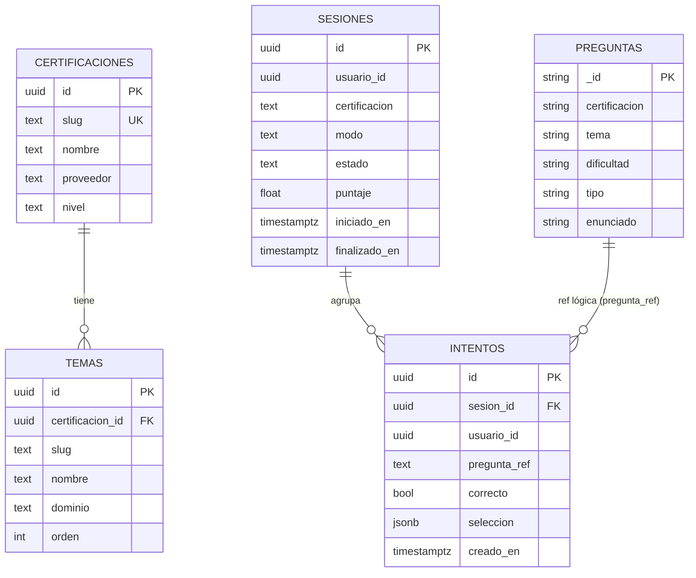
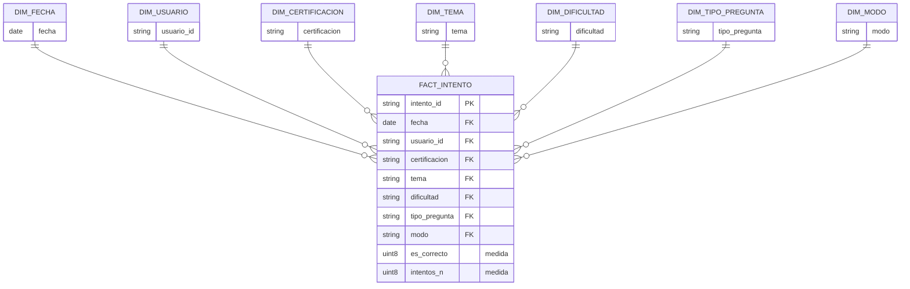
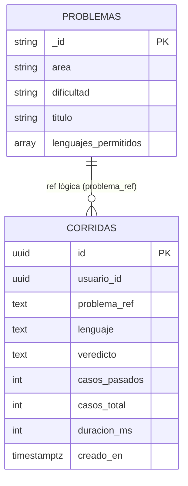
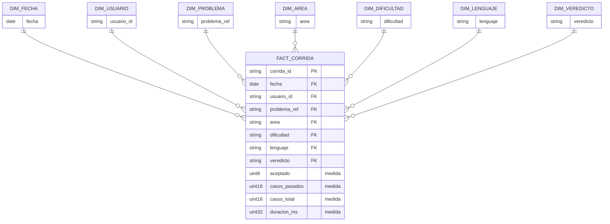
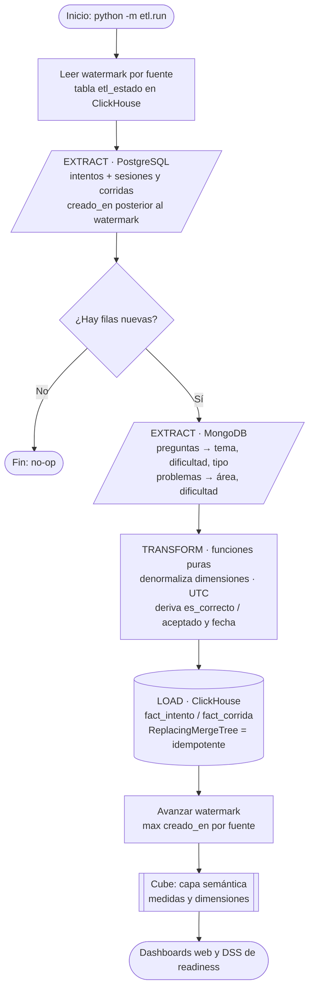

# Proyecto 4 (Libre) — CertReady: OLAP, ETL y Modelado dimensional

Documento de entrega. Demuestra que **CertReady** cumple los tres requisitos del
proyecto y reúne los diagramas pedidos: el **diagrama relacional** y el **diagrama
dimensional** de cada uno de los dos problemas (data marts), más el **diagrama de
flujo del proceso ETL**.

> Todos los diagramas están en **Mermaid** (se renderizan en GitHub y en VS Code
> con la extensión *Markdown Preview Mermaid*). El detalle de implementación vive
> en `data/etl/` (ETL), `data/etl/schema.sql` (ClickHouse) y `data/cube/` (capa
> semántica). Decisiones en ADR-12.

## 1. Cómo cumple los requisitos

| Requisito | En CertReady |
|-----------|--------------|
| **ETL** | `data/etl/` en Python: extrae los hechos nuevos de PostgreSQL, los enriquece con MongoDB, transforma (funciones puras) y carga en ClickHouse. **Incremental por watermark** e **idempotente** (ReplacingMergeTree). |
| **Modelado dimensional** | Esquema **estrella**: hechos `fact_intento` y `fact_corrida`; dimensiones (fecha, usuario, certificación, tema, dificultad, área, lenguaje, veredicto…) modeladas en **Cube**. Grano = una fila por evento atómico (un intento de pregunta / una corrida del juez). |
| **OLAP** | **ClickHouse** (motor columnar) como almacén analítico + **Cube** como capa semántica (medidas y dimensiones) que alimenta dashboards y el DSS de *readiness*. |

**Las dos fuentes operativas = los dos problemas (data marts):**

1. **Desempeño en exámenes** — cada intento de pregunta en un simulacro/práctica.
   Mide **acierto** por certificación, tema, dificultad y tiempo.
2. **Práctica de código (juez)** — cada corrida de código evaluada por el juez.
   Mide **tasa de aceptación**, casos pasados y duración por área y lenguaje.

---

## 2. Problema 1 — Desempeño en exámenes

### 2.1 Diagrama relacional (origen OLTP)

Lo transaccional vive en **PostgreSQL** (esquemas `catalog`, `exams`); el contenido
de las preguntas vive en **MongoDB** (colección `preguntas`). `pregunta_ref` es una
referencia lógica entre almacenes (el cliente nunca hace el join; lo resuelve el ETL).

- `PREGUNTAS` es una **colección MongoDB** (esquema flexible); el resto son tablas
  PostgreSQL.
- El **hecho atómico** es `INTENTOS` (un intento por pregunta). `SESIONES` da el
  contexto (certificación, modo); `PREGUNTAS` aporta tema/dificultad/tipo.

### 2.2 Diagrama dimensional (estrella `fact_intento`)

Modelo en estrella: un hecho central rodeado de dimensiones. En ClickHouse se
implementa como **estrella plana** (las dimensiones se denormalizan como columnas
del hecho; Cube las expone como dimensiones lógicas), idiomático en un motor
columnar y sin joins en el ETL.

- **Grano:** un intento de pregunta.
- **Medidas:** `es_correcto` (0/1) e `intentos_n`. Cube deriva **`accuracy`** =
  `sum(es_correcto)/count()`.
- **Dimensiones:** fecha, usuario, certificación, tema, dificultad, tipo de
  pregunta y modo (simulacro/práctica).

---

## 3. Problema 2 — Práctica de código (juez)

### 3.1 Diagrama relacional (origen OLTP)

Las corridas (resultados de calificación) viven en **PostgreSQL** (`judge.corridas`);
la definición del problema (área, dificultad) vive en **MongoDB** (colección
`problemas`), referenciada por `problema_ref`.

- **Hecho atómico:** `CORRIDAS` (una corrida evaluada por el juez).
- `veredicto` ∈ {accepted, wrong_answer, time_limit_exceeded, …}.

### 3.2 Diagrama dimensional (estrella `fact_corrida`)

- **Grano:** una corrida del juez.
- **Medidas:** `aceptado` (0/1), `casos_pasados`, `casos_total`, `duracion_ms`.
  Cube deriva **`tasa_aceptacion`** = `sum(aceptado)/count()`.
- **Dimensiones:** fecha, usuario, problema, área, dificultad, lenguaje, veredicto.

---

## 4. Diagrama de flujo del proceso ETL

Una pasada del ETL (`python -m etl.run`) es **incremental** (solo lee lo nuevo
desde el *watermark*) e **idempotente** (reejecutar sin datos nuevos no cambia nada).

**Pasos:**

1. **Watermark** — lee el último timestamp procesado por fuente (`intentos`,
   `corridas`) desde `etl_estado`.
2. **Extract (PostgreSQL)** — hechos nuevos: `exams.intentos ⋈ exams.sesiones` y
   `judge.corridas`, filtrando `creado_en > watermark` (consultas parametrizadas).
3. **Extract (MongoDB)** — enriquecimiento: `preguntas` (tema/dificultad/tipo) y
   `problemas` (área/dificultad), solo de las refs que aparecen en los hechos.
4. **Transform** — funciones **puras** (sin I/O, testeables): normaliza a UTC,
   denormaliza las dimensiones en el hecho, deriva `es_correcto`/`aceptado` y `fecha`.
5. **Load (ClickHouse)** — inserta en `fact_intento`/`fact_corrida`
   (`ReplacingMergeTree` → idempotente por id).
6. **Avanzar watermark** — guarda el `max(creado_en)` cargado por fuente.
7. **Cube** expone las medidas/dimensiones; los **dashboards** y el **DSS** las consumen.

---

## 5. Notas de diseño

- **Estrella plana (ClickHouse):** no se crean claves subrogadas ni tablas de
  dimensión físicas; el hecho denormaliza las dimensiones como columnas. Es el
  patrón idiomático en un motor columnar (evita joins, aprovecha `LowCardinality`).
  El modelo *lógico* sigue siendo una estrella (la que muestran los diagramas).
- **Tiempo:** columnas de tiempo en `DateTime64(6)` (microsegundos) para que el
  watermark no reprocese filas del mismo segundo. Todo en **UTC**.
- **Idempotencia:** `ReplacingMergeTree` ordena por el id del hecho; reinsertar la
  misma fila no duplica.
- **Separación políglota:** Python vive **solo** en la capa de datos (ETL/OLAP/DSS);
  los servicios de app (Go) producen los hechos; el cliente nunca toca el almacén.
